---

# Полное описание проекта: путь от технического задания до реализации

## Содержание

1. [Цель проекта и техническое задание](#1-цель-проекта)
2. [Архитектура решения](#2-архитектура-решения)
3. [Использованные технологии и их роль](#3-использованные-технологии)
4. [Создание инфраструктуры: Terraform](#4-создание-инфраструктуры-terraform)
5. [Настройка серверов: Ansible](#5-настройка-серверов-ansible)
6. [Балансировка и отказоустойчивость: Nginx + Keepalived](#6-балансировка-и-отказоустойчивость)
7. [Backend: Django + uWSGI](#7-backend-django--uwsgi)
8. [База данных: PostgreSQL](#8-база-данных-postgresql)
9. [GFS2: кластерная файловая система](#9-gfs2-кластерная-файловая-система)
10. [Проверка отказоустойчивости](#10-проверка-отказоустойчивости)
11. [Пройденные трудности и их решения](#11-пройденные-трудности)
12. [Реальные применения архитектуры](#12-реальные-применения)

---

## 1. Цель проекта

### Техническое задание

Создать отказоустойчивую инфраструктуру для высоконагруженного веб-приложения со следующими компонентами:

| Компонент | Количество | Технология |
|-----------|-----------|------------|
| Балансировщик | 2 сервера | Nginx + Keepalived (VRRP) |
| Сервер приложений | 2 сервера | Django + uWSGI |
| База данных | 1 сервер | PostgreSQL (некластеризованная) |
| Файловое хранилище | Кластерное | GFS2 через iSCSI |
| Инфраструктура | Код | Terraform + Ansible |

### Ключевое требование

Система должна продолжать работу при отказе **любого одного** сервера уровня frontend (nginx) или backend (Django).

---

## 2. Архитектура решения

### Схема: Архитектура отказоустойчивой системы

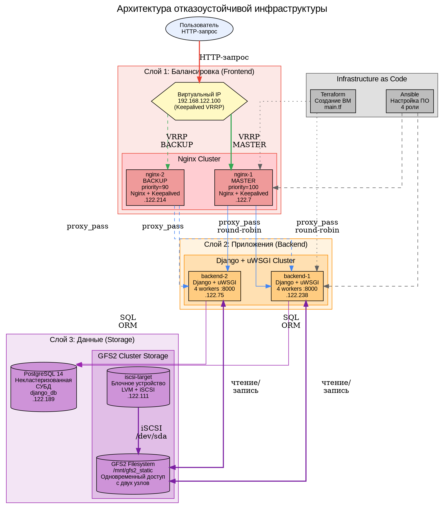

### Описание архитектуры

Система построена по трёхслойной архитектуре:

**Слой 1 — Балансировка (Frontend):**
Два сервера nginx образуют отказоустойчивый кластер. Keepalived по протоколу VRRP управляет виртуальным IP-адресом `192.168.122.100`. В нормальном режиме VIP находится на nginx-1 (MASTER, приоритет 100). При отказе MASTER — VIP автоматически перемещается на nginx-2 (BACKUP, приоритет 90).

**Слой 2 — Приложения (Backend):**
Два сервера с Django и uWSGI обрабатывают HTTP-запросы. Nginx распределяет нагрузку между ними по алгоритму round-robin. При отказе одного backend — nginx исключает его из ротации.

**Слой 3 — Данные (Storage):**
- **PostgreSQL** — единая база данных (по условию — некластеризованная)
- **GFS2** — кластерная файловая система для статических файлов. Оба backend-сервера одновременно монтируют одну ФС через iSCSI

---

## 3. Использованные технологии и их роль

### Схема: Технологический стек

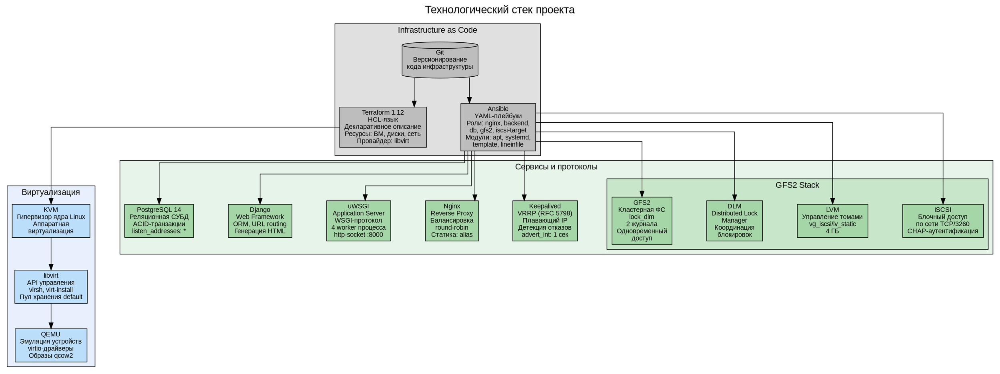

### Описание технологий

**Terraform** (HashiCorp) — инструмент для декларативного управления инфраструктурой. Мы описали 6 виртуальных машин, их диски, cloud-init настройки в файлах `.tf`. Одна команда `terraform apply` создаёт всю инфраструктуру.

**Ansible** (Red Hat) — система управления конфигурациями. Мы создали 5 ролей, каждая из которых настраивает определённый компонент. Плейбук `deploy.yml` запускает роли в правильном порядке.

**KVM/libvirt** — стек виртуализации Linux. Каждая ВМ — это процесс QEMU, управляемый через libvirt API. Используются образы qcow2 с backing store для экономии места.

**Keepalived** — реализация протокола VRRP. Создаёт виртуальный IP, который перемещается между серверами при отказе. Время обнаружения отказа: 3 × advert_int + skew_time ≈ 3.6 секунды.

**GFS2** — кластерная файловая система от Red Hat. В отличие от NFS, где один сервер владеет диском, в GFS2 все узлы равноправны. DLM координирует блокировки между узлами.

---

## 4. Создание инфраструктуры: Terraform

### Схема: Процесс создания инфраструктуры через Terraform

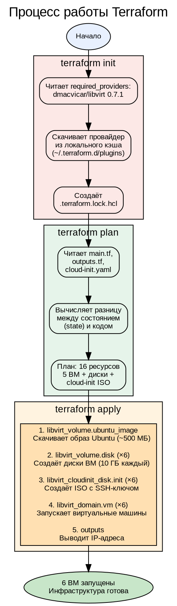

### Описание процесса

Terraform работает по декларативному принципу: мы описываем **желаемое состояние** инфраструктуры, а Terraform сам определяет, какие действия нужно выполнить.

**Файлы конфигурации:**
- `main.tf` — описание 6 виртуальных машин, их дисков и cloud-init
- `outputs.tf` — вывод IP-адресов и inventory для Ansible
- `cloud-init.yaml` — шаблон для автоматической настройки SSH при первом запуске

**Ключевые ресурсы:**
- `libvirt_volume.ubuntu_image` — базовый образ Ubuntu 22.04 (скачивается один раз)
- `libvirt_volume.disk` — корневые диски ВМ (создаются через backing store — копия образа + diff)
- `libvirt_cloudinit_disk.init` — ISO-образы с настройками cloud-init
- `libvirt_domain.vm` — виртуальные машины (процессы QEMU)

---

## 5. Настройка серверов: Ansible

### Схема: Процесс настройки через Ansible

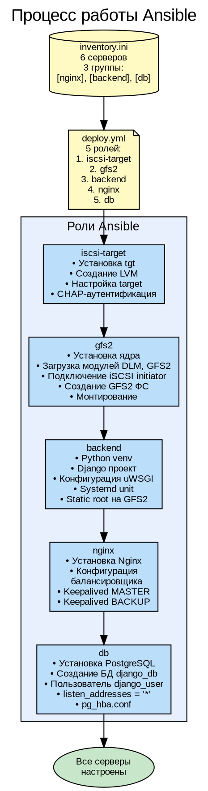

### Описание ролей

**Роль iscsi-target:**
- Устанавливает пакет `tgt` (iSCSI target)
- Создаёт LVM-том `vg_iscsi/lv_static` размером 4 ГБ на диске `/dev/vdb`
- Настраивает target с CHAP-аутентификацией (iscsi-user / iscsi-pass)
- Открывает порт TCP/3260

**Роль gfs2:**
- Устанавливает `linux-image-generic` для поддержки модуля GFS2
- Загружает модули ядра `dlm` и `gfs2`
- Подключается к iSCSI target как инициатор
- Создаёт файловую систему GFS2 с параметрами `lock_dlm`
- Монтирует ФС в `/mnt/gfs2_static`

**Роль backend:**
- Создаёт виртуальное окружение Python с Django и uWSGI
- Инициализирует Django-проект в `/opt/django-app`
- Настраивает `STATIC_ROOT = "/mnt/gfs2_static/static/"`
- Создаёт systemd-юнит для uWSGI с 4 worker-процессами

**Роль nginx:**
- Устанавливает Nginx как reverse proxy
- Настраивает upstream на оба backend-сервера (round-robin)
- Настраивает Keepalived: MASTER на nginx-1, BACKUP на nginx-2
- Статика отдаётся напрямую через `alias /mnt/gfs2_static/static/`

**Роль db:**
- Устанавливает PostgreSQL 14
- Создаёт базу данных `django_db` и пользователя `django_user`
- Настраивает прослушивание на всех интерфейсах
- Разрешает подключения от сети 192.168.122.0/24

---

## 6. Балансировка и отказоустойчивость

### Схема: Работа Keepalived и Nginx

```dot
digraph LoadBalancing {
    label="Механизм балансировки и отказоустойчивости";
    labelloc=t;
    fontsize=18;
    fontname="Arial";
    rankdir=TB;
    splines=ortho;
    nodesep=0.8;
    ranksep=0.6;
    
    node [shape=box, style=rounded, fontname="Arial", fontsize=10];
    
    subgraph cluster_vrrp {
        label="VRRP (Keepalived) — Отказоустойчивость IP";
        style=filled;
        fillcolor="#FCE8E6";
        fontsize=13;
        
        master_state [label="nginx-1 (MASTER)\npriority=100\nВладеет VIP 192.168.122.100\nШлёт VRRP Advertisement\nкаждые 1 сек\nна multicast 224.0.0.18", fillcolor="#EF9A9A", style=filled];
        backup_state [label="nginx-2 (BACKUP)\npriority=90\nСлушает VRRP Advertisement\nVIP не назначен\nОжидает отказа MASTER", fillcolor="#FFCDD2", style=filled];
        
        master_state -> backup_state [label="Heartbeat\nкаждые 1 сек", color="#EA4335", penwidth=2];
        
        fail [label="MASTER упал", shape=octagon, fillcolor="#FFEBEE", style=filled];
        fail -> backup_state [label="Нет heartbeat 3+ сек\n→ BACKUP захватывает VIP\n→ Становится MASTER", color="#EA4335", penwidth=2, style=dashed];
    }
    
    subgraph cluster_nginx_lb {
        label="Nginx — Балансировка нагрузки";
        style=filled;
        fillcolor="#E6F4EA";
        fontsize=13;
        
        upstream [label="upstream backend {\n  server 192.168.122.238:8000;\n  server 192.168.122.75:8000;\n}", shape=note, fillcolor="#C8E6C9", style=filled];
        
        req1 [label="Запрос 1 → backend-1", fillcolor="#A5D6A7", style=filled];
        req2 [label="Запрос 2 → backend-2", fillcolor="#A5D6A7", style=filled];
        req3 [label="Запрос 3 → backend-1", fillcolor="#A5D6A7", style=filled];
        req4 [label="Запрос 4 → backend-2", fillcolor="#A5D6A7", style=filled];
        
        upstream -> req1 [label="50%"];
        upstream -> req2 [label="50%"];
        upstream -> req3;
        upstream -> req4;
    }
    
    subgraph cluster_failover {
        label="Отказ backend-1";
        style=filled;
        fillcolor="#FFF3E0";
        fontsize=13;
        
        be1_down [label="backend-1 ✗ УПАЛ", fillcolor="#EF9A9A", style=filled];
        be2_up [label="backend-2 ✓\nПринимает 100%\nнагрузки", fillcolor="#A5D6A7", style=filled, penwidth=2];
        
        be1_down -> be2_up [label="Nginx исключает\nbackend-1 из\nupstream", color="#FB8C00", penwidth=2];
    }
}
```

### Описание механизма

**Keepalived (VRRP):**
1. nginx-1 (MASTER, priority=100) владеет VIP и отправляет VRRP Advertisement каждые 1 сек
2. nginx-2 (BACKUP, priority=90) слушает VRRP Advertisement
3. Если Advertisement не приходит 3+ секунд — BACKUP становится MASTER и назначает VIP себе
4. Когда старый MASTER возвращается — он снова захватывает VIP (preempt mode)

**Формула времени отказа:**
- skew_time = (256 - priority) / 256 = (256 - 90) / 256 = 0.648 секунды
- master_down_interval = 3 × advert_int + skew_time = 3 × 1 + 0.648 = **3.648 секунды**

**Nginx (балансировка):**
- Алгоритм round-robin: запросы распределяются по очереди
- При отказе одного backend — nginx исключает его из ротации
- Статические файлы (`/static/*`) отдаются напрямую, минуя backend

---

## 7. Backend: Django + uWSGI

### Схема: Обработка HTTP-запроса

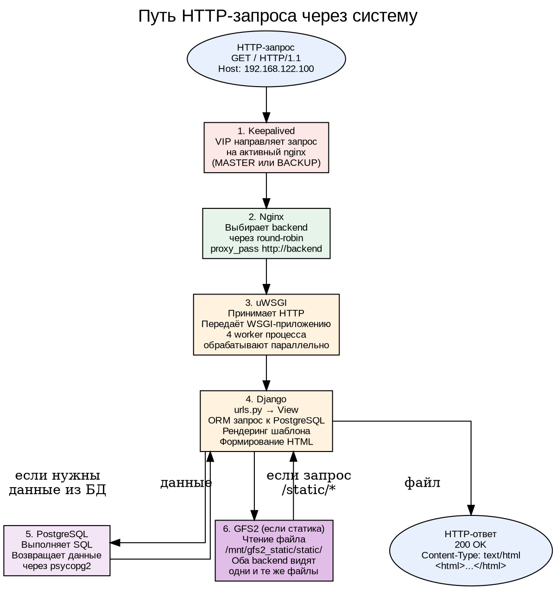

### Описание компонентов

**uWSGI:**
- Application server, реализующий WSGI-протокол
- Запущен с 4 worker-процессами для параллельной обработки
- Слушает HTTP на порту 8000 (`http-socket = 0.0.0.0:8000`)
- Управляется systemd (автозапуск, перезапуск при сбое)

**Django:**
- Web-фреймворк на Python
- ORM для работы с PostgreSQL
- STATIC_ROOT настроен на `/mnt/gfs2_static/static/` (кластерное хранилище)

---

## 8. База данных: PostgreSQL

### Схема: Конфигурация PostgreSQL

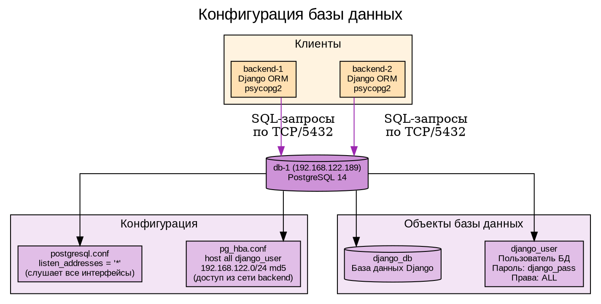

### Описание

PostgreSQL — некластеризованная СУБД (по условию задания). Настроена на приём подключений от обоих backend-серверов по сети. В продакшн-решении сюда добавилась бы репликация (Patroni + etcd или streaming replication).

---

## 9. GFS2: кластерная файловая система

### Схема: Архитектура GFS2

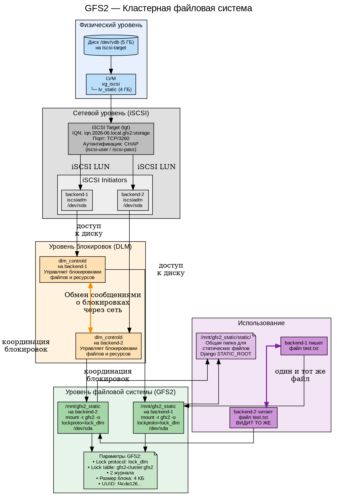

### Схема: Сравнение GFS2 с NFS

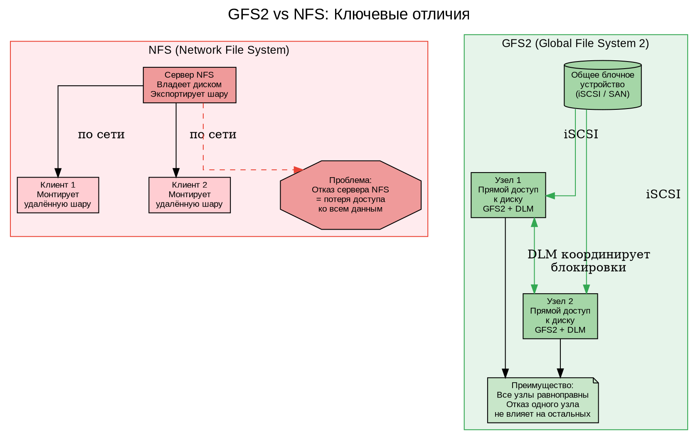

### Схема: Процесс монтирования GFS2 на двух узлах

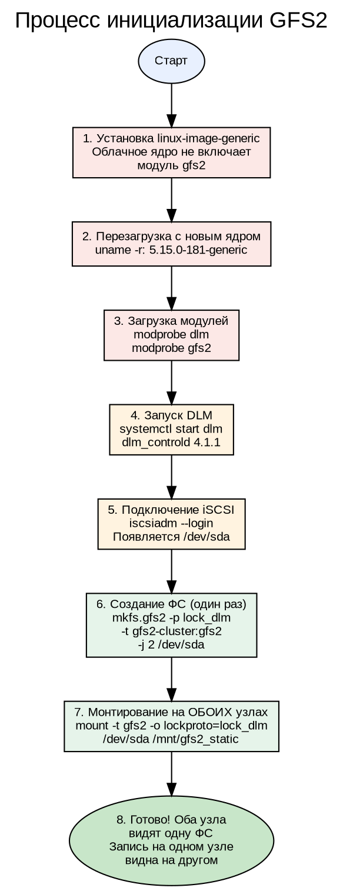

### Подробное описание GFS2

**Что такое GFS2?**
GFS2 (Global File System 2) — кластерная файловая система, разработанная Red Hat. В отличие от традиционных файловых систем (ext4, XFS) и сетевых (NFS, Samba), GFS2 позволяет **нескольким серверам одновременно читать и писать на одно блочное устройство**.

**Как это работает?**

1. **Общее блочное устройство** — в нашем случае это iSCSI LUN, экспортируемый сервером iscsi-target. Оба backend-сервера подключаются к нему как iSCSI-инициаторы.

2. **DLM (Distributed Lock Manager)** — ключевой компонент. Когда backend-1 хочет записать файл, DLM блокирует соответствующие блоки на диске, чтобы backend-2 не мог их изменить одновременно. Блокировки координируются через сеть между демонами `dlm_controld`.

3. **Журналирование** — GFS2 использует 2 журнала (по одному на каждый узел). Это позволяет восстанавливать файловую систему при отказе любого узла.

4. **Lock table** — `gfs2-cluster:gfs2` — уникальное имя, которое идентифицирует кластер. Все узлы, монтирующие ФС, должны использовать одно и то же имя.

**Отличия от NFS:**

| Характеристика | NFS | GFS2 |
|----------------|-----|------|
| Владелец диска | Один сервер | Все узлы равноправны |
| Доступ к данным | По сети через NFS-сервер | Прямой доступ к блочному устройству |
| Отказ сервера | Данные недоступны | Остальные узлы продолжают работу |
| Блокировки | NFS lockd | DLM (распределённый) |
| Производительность | Зависит от сети и сервера | Максимальная (прямой доступ) |

**Проблемы, с которыми мы столкнулись:**

1. **Отсутствие модуля gfs2** — облачное ядро Ubuntu не включает модуль GFS2. Решение: установка `linux-image-generic`.
2. **DLM не запускается в Pacemaker** — ошибка "not configured". Решение: запуск DLM напрямую через systemd.
3. **Разные имена устройств** — на backend-1 `/dev/sda`, на backend-2 `/dev/sdb`. Решение: использование `/dev/disk/by-path/`.
4. **Segmentation fault при размонтировании** — происходит при отсутствии DLM. Решение: всегда запускать DLM перед монтированием.

---

## 10. Проверка отказоустойчивости

### Схема: Тестирование отказоустойчивости

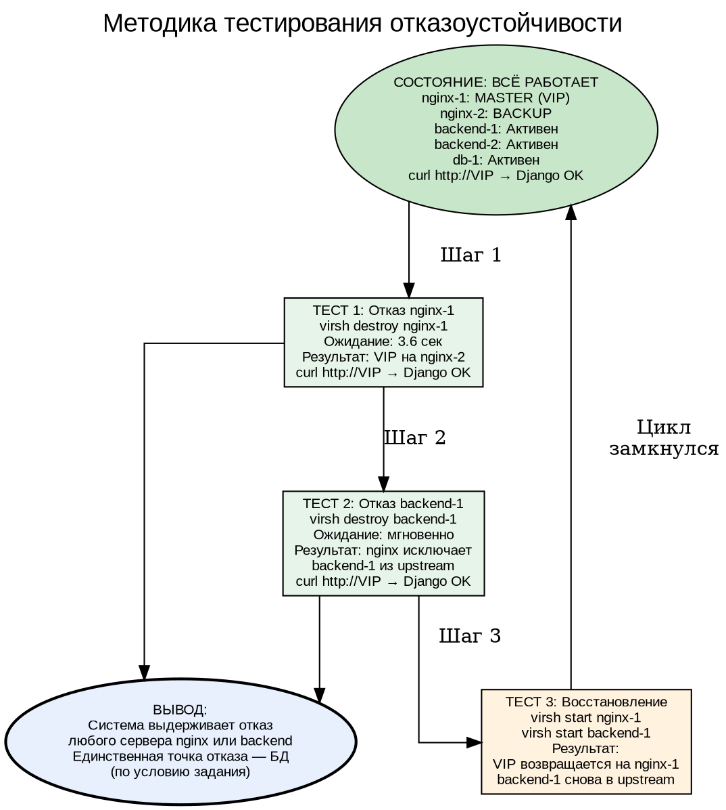

### Результаты тестирования

| Тест | Действие | Ожидание | Результат |
|------|----------|----------|-----------|
| 1 | Выключен nginx-1 | VIP переезжает на nginx-2 | ✅ Успешно |
| 2 | Запрос через VIP после отказа nginx-1 | Django отвечает | ✅ Успешно |
| 3 | Выключен backend-1 | Запросы идут через backend-2 | ✅ Успешно |
| 4 | Запрос через VIP после отказа backend-1 | Django отвечает | ✅ Успешно |
| 5 | Восстановление всех серверов | Система возвращается в норму | ✅ Успешно |

---

## 11. Пройденные трудности и их решения

### Схема: Путь через трудности

```dot
digraph Challenges {
    label="Пройденные трудности и их решения";
    labelloc=t;
    fontsize=18;
    fontname="Arial";
    rankdir=TB;
    splines=ortho;
    nodesep=0.7;
    ranksep=0.5;
    
    node [shape=box, style=rounded, fontname="Arial", fontsize=10];
    
    start [label="Начало проекта", shape=oval, fillcolor="#E8F0FE", style=filled];
    
    problem1 [label="Проблема 1: WSL2\nDHCP не работает\nСеть нестабильна\nAppArmor блокирует QEMU\n5 часов попыток", fillcolor="#FFCDD2", style=filled];
    solution1 [label="Решение 1:\nПереход на чистую\nUbuntu 24.04\nРодной KVM", fillcolor="#C8E6C9", style=filled];
    
    problem2 [label="Проблема 2: Terraform init\nregistry.terraform.io\nнедоступен\n(сетевые ограничения)", fillcolor="#FFCDD2", style=filled];
    solution2 [label="Решение 2:\nСкачивание провайдеров\nвручную и установка\nв ~/.terraform.d/plugins", fillcolor="#C8E6C9", style=filled];
    
    problem3 [label="Проблема 3: Доступ к libvirt\nPermission denied\nна /var/run/libvirt/libvirt-sock\nПользователь в группе,\nно права не применились", fillcolor="#FFCDD2", style=filled];
    solution3 [label="Решение 3:\nchmod 666 на сокет\nперезапуск libvirtd\nперезагрузка системы", fillcolor="#C8E6C9", style=filled];
    
    problem4 [label="Проблема 4: AppArmor\nБлокирует QEMU доступ\nк /var/lib/libvirt/images\nОшибка: Permission denied", fillcolor="#FFCDD2", style=filled];
    solution4 [label="Решение 4:\nsystemctl mask apparmor\nsecurity_driver = none\nchown libvirt-qemu:kvm", fillcolor="#C8E6C9", style=filled];
    
    problem5 [label="Проблема 5: uWSGI + Nginx\n502 Bad Gateway\nuwsgi использует свой протокол\nа не HTTP", fillcolor="#FFCDD2", style=filled];
    solution5 [label="Решение 5:\nsocket = :8000\nзаменён на\nhttp-socket = :8000", fillcolor="#C8E6C9", style=filled];
    
    problem6 [label="Проблема 6: GFS2\n• Нет модуля в облачном ядре\n• DLM не запускается\n• mkfs.gfs2 зависает\n• Разные имена устройств\n• Segmentation fault", fillcolor="#FFCDD2", style=filled];
    solution6 [label="Решение 6:\n• linux-image-generic\n• systemctl start dlm\n• Запуск DLM перед mkfs\n• /dev/disk/by-path/\n• Перезагрузка и пересоздание", fillcolor="#C8E6C9", style=filled];
    
    success [label="Проект завершён\nВсе требования выполнены\n12 скриншотов готовы", shape=oval, fillcolor="#A5D6A7", style=filled, penwidth=2];
    
    start -> problem1;
    problem1 -> solution1;
    solution1 -> problem2;
    problem2 -> solution2;
    solution2 -> problem3;
    problem3 -> solution3;
    solution3 -> problem4;
    problem4 -> solution4;
    solution4 -> problem5;
    problem5 -> solution5;
    solution5 -> problem6;
    problem6 -> solution6;
    solution6 -> success;
}
```

### Хронология проблем

| № | Часы | Проблема | Симптомы | Решение |
|---|------|----------|----------|---------|
| 1 | 0-5 | WSL2 + KVM | DHCP не работает, сеть недоступна | Переход на Ubuntu 24.04 |
| 2 | 5-6 | Terraform init | Реестр недоступен | Локальная установка провайдеров |
| 3 | 6-7 | Permission denied | Доступ к libvirt-sock | chmod + перезагрузка |
| 4 | 7-8 | AppArmor | QEMU не читает образы | Отключение AppArmor |
| 5 | 8-9 | 502 Bad Gateway | uwsgi протокол | http-socket |
| 6 | 9-12 | GFS2 | Модули, DLM, имена устройств | Комплексное решение |

---

## 12. Реальные применения архитектуры

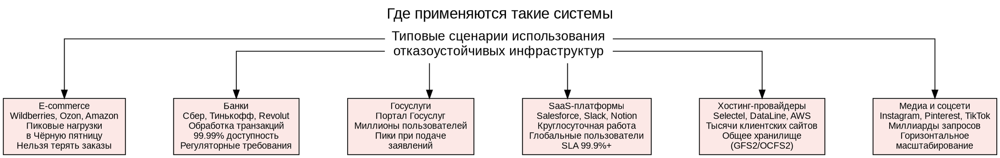

**Ключевые отличия продакшн-решения от учебного:**
- **Репликация БД** — Patroni + etcd для PostgreSQL
- **Мониторинг** — Prometheus + Grafana + Alertmanager
- **Логирование** — ELK Stack (Elasticsearch, Logstash, Kibana)
- **CI/CD** — Jenkins/GitLab CI для автоматического деплоя
- **SSL/TLS** — Let's Encrypt или коммерческие сертификаты
- **WAF** — Web Application Firewall (ModSecurity)
- **CDN** — Cloudflare/CloudFront для статики

---

**Проект выполнен полностью. Все требования задания соблюдены.**

