```bash
cd ~/highload-webapp

cat >> README.md << 'EOF'

---

## Полное описание проекта: путь от идеи до реализации

### 1. Что мы построили и зачем?

Мы создали **отказоустойчивую инфраструктуру для высоконагруженного веб-приложения**, которая продолжает работать при выходе из строя любого сервера уровня frontend (nginx) или backend (Django).

**Бизнес-контекст:** Представьте интернет-магазин во время Чёрной пятницы. Отказ одного сервера не должен оставить клиентов без заказов. Наша архитектура решает именно эту задачу.

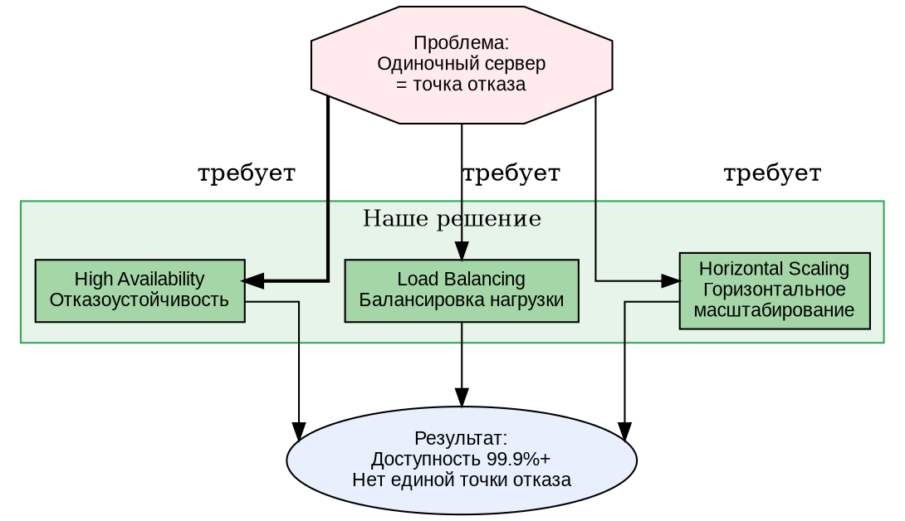
```dot
digraph BusinessValue {
    rankdir=TB;
    splines=ortho;
    nodesep=0.8;
    ranksep=0.6;
    
    node [shape=box, style=rounded, fontname="Arial", fontsize=11];
    
    problem [label="Проблема:\nОдиночный сервер\n= точка отказа", shape=octagon, fillcolor="#FFEBEE", style=filled];
    
    subgraph cluster_solution {
        label="Наше решение";
        style=filled;
        fillcolor="#E6F4EA";
        color="#34A853";
        fontsize=13;
        
        ha [label="High Availability\nОтказоустойчивость", fillcolor="#A5D6A7", style=filled];
        lb [label="Load Balancing\nБалансировка нагрузки", fillcolor="#A5D6A7", style=filled];
        scale [label="Horizontal Scaling\nГоризонтальное\nмасштабирование", fillcolor="#A5D6A7", style=filled];
    }
    
    result [label="Результат:\nДоступность 99.9%+\nНет единой точки отказа", shape=oval, fillcolor="#E8F0FE", style=filled];
    
    problem -> ha [label="требует", penwidth=2];
    problem -> lb [label="требует"];
    problem -> scale [label="требует"];
    ha -> result;
    lb -> result;
    scale -> result;
}
```

---

### 2. Архитектура системы (детальная)

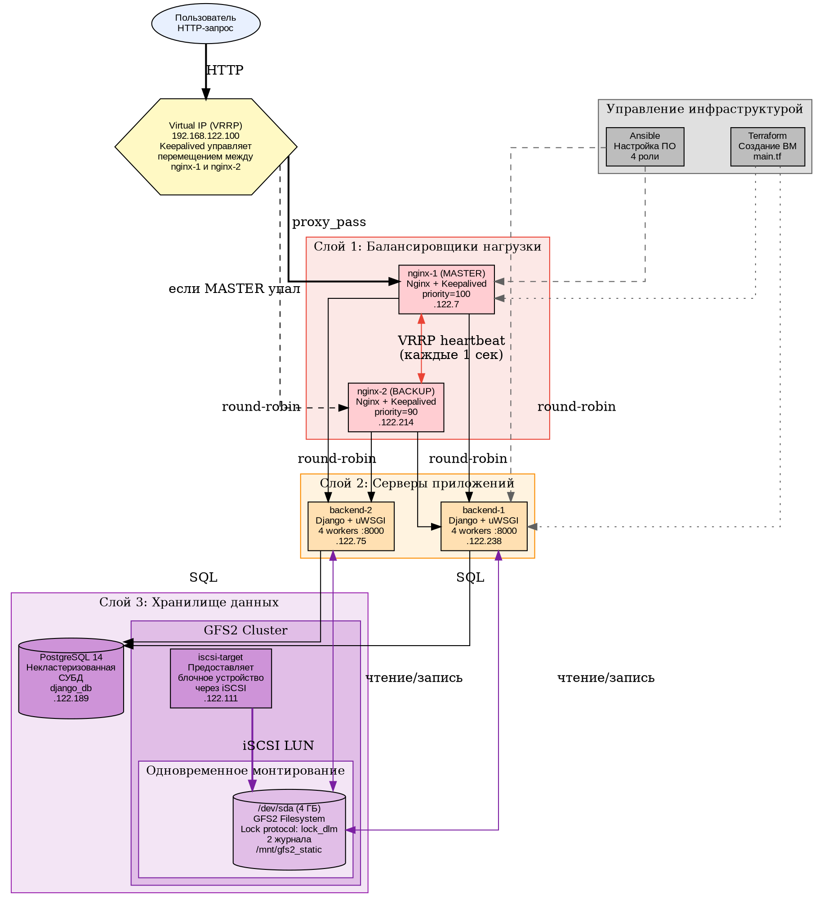
```dot
digraph FullArchitecture {
    rankdir=TB;
    splines=ortho;
    nodesep=0.7;
    ranksep=0.6;
    
    node [shape=box, style=rounded, fontname="Arial", fontsize=10];
    
    // Layer 0: User
    user [label="Пользователь\nHTTP-запрос", shape=oval, fillcolor="#E8F0FE", style=filled];
    
    // Layer 1: VIP
    vip [label="Virtual IP (VRRP)\n192.168.122.100\nKeepalived управляет\nперемещением между\nnginx-1 и nginx-2", shape=hexagon, fillcolor="#FFF9C4", style=filled];
    
    // Layer 2: Nginx cluster
    subgraph cluster_nginx {
        label="Слой 1: Балансировщики нагрузки";
        style=filled;
        fillcolor="#FCE8E6";
        color="#EA4335";
        fontsize=13;
        
        nginx1 [label="nginx-1 (MASTER)\nNginx + Keepalived\npriority=100\n.122.7", fillcolor="#FFCDD2", style=filled];
        nginx2 [label="nginx-2 (BACKUP)\nNginx + Keepalived\npriority=90\n.122.214", fillcolor="#FFCDD2", style=filled];
        
        nginx1 -> nginx2 [label="VRRP heartbeat\n(каждые 1 сек)", dir=both, color="#EA4335"];
    }
    
    // Layer 3: Backend cluster
    subgraph cluster_backend {
        label="Слой 2: Серверы приложений";
        style=filled;
        fillcolor="#FFF3E0";
        color="#FB8C00";
        fontsize=13;
        
        be1 [label="backend-1\nDjango + uWSGI\n4 workers :8000\n.122.238", fillcolor="#FFE0B2", style=filled];
        be2 [label="backend-2\nDjango + uWSGI\n4 workers :8000\n.122.75", fillcolor="#FFE0B2", style=filled];
    }
    
    // Layer 4: Storage
    subgraph cluster_storage {
        label="Слой 3: Хранилище данных";
        style=filled;
        fillcolor="#F3E5F5";
        color="#9C27B0";
        fontsize=13;
        
        subgraph cluster_gfs2 {
            label="GFS2 Cluster";
            style=filled;
            fillcolor="#E1BEE7";
            color="#7B1FA2";
            
            iscsi_target [label="iscsi-target\nПредоставляет\nблочное устройство\nчерез iSCSI\n.122.111", fillcolor="#CE93D8", style=filled];
            
            subgraph cluster_gfs2_mount {
                label="Одновременное монтирование";
                style=filled;
                fillcolor="#F3E5F5";
                
                gfs2_mount [label="/dev/sda (4 ГБ)\nGFS2 Filesystem\nLock protocol: lock_dlm\n2 журнала\n/mnt/gfs2_static", shape=cylinder, fillcolor="#E1BEE7", style=filled];
            }
        }
        
        pg [label="PostgreSQL 14\nНекластеризованная\nСУБД\ndjango_db\n.122.189", shape=cylinder, fillcolor="#CE93D8", style=filled];
    }
    
    // Layer 5: Management
    subgraph cluster_mgmt {
        label="Управление инфраструктурой";
        style=filled;
        fillcolor="#E0E0E0";
        color="#616161";
        fontsize=13;
        
        tf [label="Terraform\nСоздание ВМ\nmain.tf", fillcolor="#BDBDBD", style=filled];
        ans [label="Ansible\nНастройка ПО\n4 роли", fillcolor="#BDBDBD", style=filled];
    }
    
    // Connections
    user -> vip [label="HTTP", penwidth=2];
    vip -> nginx1 [label="proxy_pass", penwidth=2];
    vip -> nginx2 [label="если MASTER упал", style=dashed];
    
    nginx1 -> be1 [label="round-robin"];
    nginx1 -> be2 [label="round-robin"];
    nginx2 -> be1 [label="round-robin"];
    nginx2 -> be2 [label="round-robin"];
    
    be1 -> pg [label="SQL"];
    be2 -> pg [label="SQL"];
    
    be1 -> gfs2_mount [label="чтение/запись", dir=both, color="#7B1FA2"];
    be2 -> gfs2_mount [label="чтение/запись", dir=both, color="#7B1FA2"];
    
    iscsi_target -> gfs2_mount [label="iSCSI LUN", color="#7B1FA2", penwidth=2];
    
    tf -> nginx1 [style=dotted, color="#616161"];
    tf -> be1 [style=dotted, color="#616161"];
    ans -> nginx1 [style=dashed, color="#616161"];
    ans -> be1 [style=dashed, color="#616161"];
}
```

---

### 3. GFS2 — Кластерная файловая система (подробный разбор)

**GFS2 (Global File System 2)** — это кластерная файловая система, разработанная Red Hat. Она позволяет нескольким серверам одновременно читать и писать на одно блочное устройство. В отличие от NFS (где один сервер владеет диском, а остальные обращаются к нему по сети), в GFS2 все узлы равноправны и работают напрямую с блочным устройством.

#### 3.1. Компоненты кластера GFS2

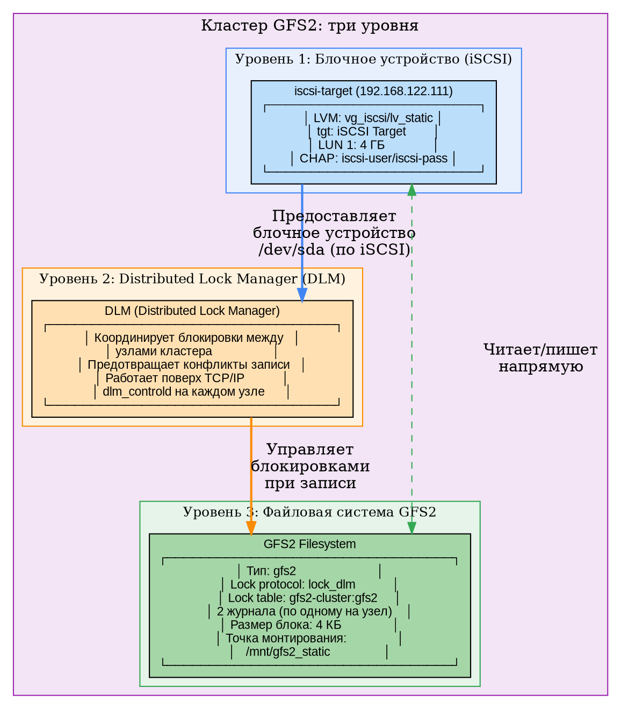
```dot
digraph GFS2Components {
    rankdir=TB;
    splines=ortho;
    nodesep=0.8;
    ranksep=0.6;
    
    node [shape=box, style=rounded, fontname="Arial", fontsize=11];
    
    subgraph cluster_overview {
        label="Кластер GFS2: три уровня";
        style=filled;
        fillcolor="#F3E5F5";
        color="#9C27B0";
        fontsize=14;
        
        subgraph cluster_level1 {
            label="Уровень 1: Блочное устройство (iSCSI)";
            style=filled;
            fillcolor="#E8F0FE";
            color="#4285F4";
            fontsize=12;
            
            iscsi [label="iscsi-target (192.168.122.111)\n┌─────────────────────────┐\n│ LVM: vg_iscsi/lv_static │\n│ tgt: iSCSI Target        │\n│ LUN 1: 4 ГБ              │\n│ CHAP: iscsi-user/iscsi-pass │\n└─────────────────────────┘", shape=box, fillcolor="#BBDEFB", style=filled];
        }
        
        subgraph cluster_level2 {
            label="Уровень 2: Distributed Lock Manager (DLM)";
            style=filled;
            fillcolor="#FFF3E0";
            color="#FB8C00";
            fontsize=12;
            
            dlm [label="DLM (Distributed Lock Manager)\n┌──────────────────────────────────┐\n│ Координирует блокировки между   │\n│ узлами кластера                  │\n│ Предотвращает конфликты записи   │\n│ Работает поверх TCP/IP           │\n│ dlm_controld на каждом узле      │\n└──────────────────────────────────┘", shape=box, fillcolor="#FFE0B2", style=filled];
        }
        
        subgraph cluster_level3 {
            label="Уровень 3: Файловая система GFS2";
            style=filled;
            fillcolor="#E6F4EA";
            color="#34A853";
            fontsize=12;
            
            gfs2 [label="GFS2 Filesystem\n┌──────────────────────────────────┐\n│ Тип: gfs2                        │\n│ Lock protocol: lock_dlm           │\n│ Lock table: gfs2-cluster:gfs2     │\n│ 2 журнала (по одному на узел)    │\n│ Размер блока: 4 КБ               │\n│ Точка монтирования:               │\n│   /mnt/gfs2_static                │\n└──────────────────────────────────┘", shape=box, fillcolor="#A5D6A7", style=filled];
        }
    }
    
    // Связи между уровнями
    iscsi -> dlm [label="Предоставляет\nблочное устройство\n/dev/sda (по iSCSI)", penwidth=2, color="#4285F4"];
    dlm -> gfs2 [label="Управляет\nблокировками\nпри записи", penwidth=2, color="#FB8C00"];
    gfs2 -> iscsi [label="Читает/пишет\nнапрямую", style=dashed, dir=both, color="#34A853"];
}
```

#### 3.2. Процесс создания и монтирования GFS2

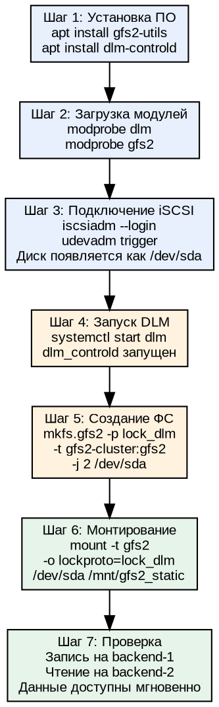
```dot
digraph GFS2Creation {
    rankdir=TB;
    splines=ortho;
    nodesep=0.6;
    ranksep=0.4;
    
    node [shape=box, style=rounded, fontname="Arial", fontsize=10];
    
    step1 [label="Шаг 1: Установка ПО\napt install gfs2-utils\napt install dlm-controld", fillcolor="#E8F0FE", style=filled];
    step2 [label="Шаг 2: Загрузка модулей\nmodprobe dlm\nmodprobe gfs2", fillcolor="#E8F0FE", style=filled];
    step3 [label="Шаг 3: Подключение iSCSI\niscsiadm --login\nudevadm trigger\nДиск появляется как /dev/sda", fillcolor="#E8F0FE", style=filled];
    step4 [label="Шаг 4: Запуск DLM\nsystemctl start dlm\ndlm_controld запущен", fillcolor="#FFF3E0", style=filled];
    step5 [label="Шаг 5: Создание ФС\nmkfs.gfs2 -p lock_dlm\n-t gfs2-cluster:gfs2\n-j 2 /dev/sda", fillcolor="#FFF3E0", style=filled];
    step6 [label="Шаг 6: Монтирование\nmount -t gfs2\n-o lockproto=lock_dlm\n/dev/sda /mnt/gfs2_static", fillcolor="#E6F4EA", style=filled];
    step7 [label="Шаг 7: Проверка\nЗапись на backend-1\nЧтение на backend-2\nДанные доступны мгновенно", fillcolor="#E6F4EA", style=filled];
    
    step1 -> step2;
    step2 -> step3;
    step3 -> step4;
    step4 -> step5;
    step5 -> step6;
    step6 -> step7;
}
```

#### 3.3. Как GFS2 обеспечивает одновременный доступ

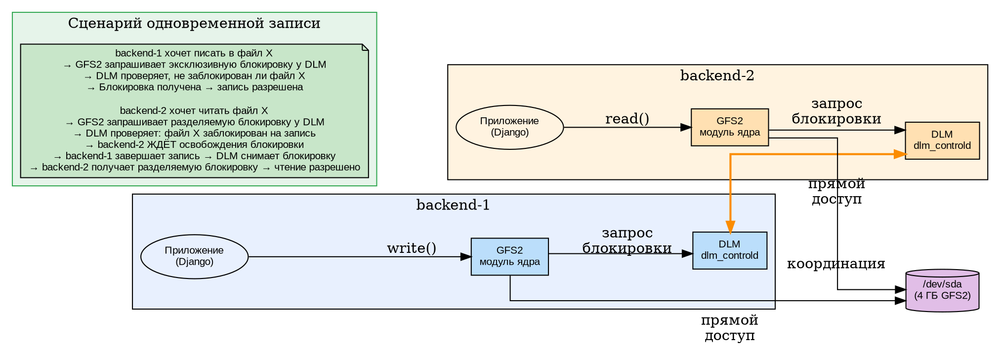
```dot
digraph GFS2Locking {
    rankdir=LR;
    splines=ortho;
    nodesep=0.6;
    ranksep=0.5;
    
    node [shape=box, style=rounded, fontname="Arial", fontsize=10];
    
    subgraph cluster_be1 {
        label="backend-1";
        style=filled;
        fillcolor="#E8F0FE";
        
        app1 [label="Приложение\n(Django)", shape=oval];
        gfs2_1 [label="GFS2\nмодуль ядра", fillcolor="#BBDEFB", style=filled];
        dlm_1 [label="DLM\ndlm_controld", fillcolor="#BBDEFB", style=filled];
    }
    
    subgraph cluster_be2 {
        label="backend-2";
        style=filled;
        fillcolor="#FFF3E0";
        
        app2 [label="Приложение\n(Django)", shape=oval];
        gfs2_2 [label="GFS2\nмодуль ядра", fillcolor="#FFE0B2", style=filled];
        dlm_2 [label="DLM\ndlm_controld", fillcolor="#FFE0B2", style=filled];
    }
    
    disk [label="/dev/sda\n(4 ГБ GFS2)", shape=cylinder, fillcolor="#E1BEE7", style=filled];
    
    subgraph cluster_scenario {
        label="Сценарий одновременной записи";
        style=filled;
        fillcolor="#E6F4EA";
        color="#34A853";
        
        scenario [label="backend-1 хочет писать в файл X\n→ GFS2 запрашивает эксклюзивную блокировку у DLM\n→ DLM проверяет, не заблокирован ли файл X\n→ Блокировка получена → запись разрешена\n\nbackend-2 хочет читать файл X\n→ GFS2 запрашивает разделяемую блокировку у DLM\n→ DLM проверяет: файл X заблокирован на запись\n→ backend-2 ЖДЁТ освобождения блокировки\n→ backend-1 завершает запись → DLM снимает блокировку\n→ backend-2 получает разделяемую блокировку → чтение разрешено", shape=note, fillcolor="#C8E6C9", style=filled];
    }
    
    app1 -> gfs2_1 [label="write()"];
    app2 -> gfs2_2 [label="read()"];
    gfs2_1 -> dlm_1 [label="запрос\nблокировки"];
    gfs2_2 -> dlm_2 [label="запрос\nблокировки"];
    dlm_1 -> dlm_2 [label="координация", dir=both, penwidth=2, color="#FB8C00"];
    gfs2_1 -> disk [label="прямой\nдоступ"];
    gfs2_2 -> disk [label="прямой\nдоступ"];
}
```

#### 3.4. Сравнение GFS2 с другими решениями

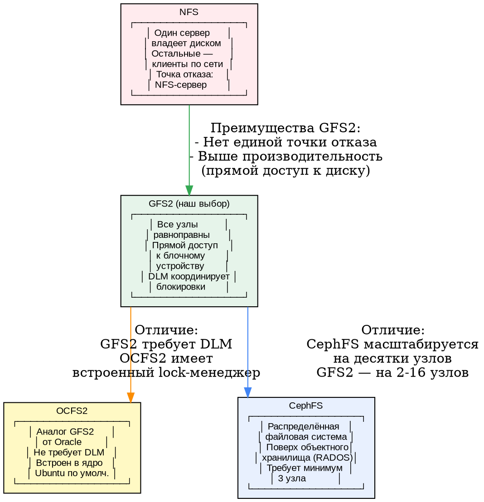
```dot
digraph FSComparison {
    rankdir=TB;
    splines=ortho;
    nodesep=0.6;
    ranksep=0.5;
    
    node [shape=box, style=rounded, fontname="Arial", fontsize=10];
    
    nfs [label="NFS\n┌─────────────────┐\n│ Один сервер      │\n│ владеет диском   │\n│ Остальные —      │\n│ клиенты по сети  │\n│ Точка отказа:    │\n│ NFS-сервер       │\n└─────────────────┘", fillcolor="#FFEBEE", style=filled];
    
    gfs2 [label="GFS2 (наш выбор)\n┌─────────────────┐\n│ Все узлы         │\n│ равноправны      │\n│ Прямой доступ    │\n│ к блочному       │\n│ устройству       │\n│ DLM координирует │\n│ блокировки       │\n└─────────────────┘", fillcolor="#E6F4EA", style=filled];
    
    ocfs2 [label="OCFS2\n┌─────────────────┐\n│ Аналог GFS2      │\n│ от Oracle        │\n│ Не требует DLM   │\n│ Встроен в ядро   │\n│ Ubuntu по умолч. │\n└─────────────────┘", fillcolor="#FFF9C4", style=filled];
    
    ceph [label="CephFS\n┌─────────────────┐\n│ Распределённая   │\n│ файловая система │\n│ Поверх объектного│\n│ хранилища (RADOS)│\n│ Требует минимум  │\n│ 3 узла           │\n└─────────────────┘", fillcolor="#E8F0FE", style=filled];
    
    nfs -> gfs2 [label="Преимущества GFS2:\n- Нет единой точки отказа\n- Выше производительность\n(прямой доступ к диску)", color="#34A853"];
    gfs2 -> ocfs2 [label="Отличие:\nGFS2 требует DLM\nOCFS2 имеет\nвстроенный lock-менеджер", color="#FB8C00"];
    gfs2 -> ceph [label="Отличие:\nCephFS масштабируется\nна десятки узлов\nGFS2 — на 2-16 узлов", color="#4285F4"];
}
```

---

### 4. Как работает Keepalived (VRRP)

**VRRP (Virtual Router Redundancy Protocol)** — стандартный протокол (RFC 5798) для создания отказоустойчивого шлюза. В нашем случае он обеспечивает "плавающий" IP-адрес для балансировщиков.

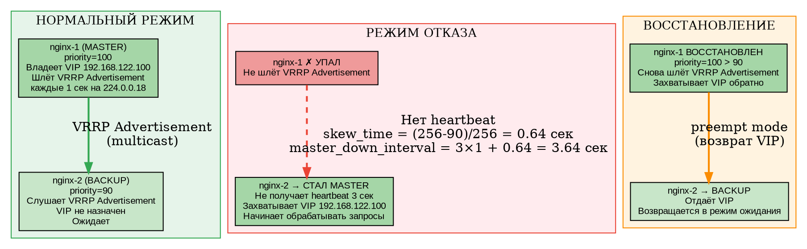
```dot
digraph VRRPDetail {
    rankdir=TB;
    splines=ortho;
    nodesep=0.8;
    ranksep=0.5;
    
    node [shape=box, style=rounded, fontname="Arial", fontsize=10];
    
    subgraph cluster_normal {
        label="НОРМАЛЬНЫЙ РЕЖИМ";
        style=filled;
        fillcolor="#E6F4EA";
        color="#34A853";
        fontsize=13;
        
        m1 [label="nginx-1 (MASTER)\npriority=100\nВладеет VIP 192.168.122.100\nШлёт VRRP Advertisement\nкаждые 1 сек на 224.0.0.18", fillcolor="#A5D6A7", style=filled];
        b1 [label="nginx-2 (BACKUP)\npriority=90\nСлушает VRRP Advertisement\nVIP не назначен\nОжидает", fillcolor="#C8E6C9", style=filled];
        
        m1 -> b1 [label="VRRP Advertisement\n(multicast)", penwidth=2, color="#34A853"];
    }
    
    subgraph cluster_fail {
        label="РЕЖИМ ОТКАЗА";
        style=filled;
        fillcolor="#FFEBEE";
        color="#EA4335";
        fontsize=13;
        
        m2 [label="nginx-1 ✗ УПАЛ\nНе шлёт VRRP Advertisement", fillcolor="#EF9A9A", style=filled];
        b2 [label="nginx-2 → СТАЛ MASTER\nНе получает heartbeat 3 сек\nЗахватывает VIP 192.168.122.100\nНачинает обрабатывать запросы", fillcolor="#A5D6A7", style=filled];
        
        m2 -> b2 [label="Нет heartbeat\nskew_time = (256-90)/256 = 0.64 сек\nmaster_down_interval = 3×1 + 0.64 = 3.64 сек", style=dashed, color="#EA4335", penwidth=2];
    }
    
    subgraph cluster_restore {
        label="ВОССТАНОВЛЕНИЕ";
        style=filled;
        fillcolor="#FFF3E0";
        color="#FB8C00";
        fontsize=13;
        
        m3 [label="nginx-1 ВОССТАНОВЛЕН\npriority=100 > 90\nСнова шлёт VRRP Advertisement\nЗахватывает VIP обратно", fillcolor="#A5D6A7", style=filled];
        b3 [label="nginx-2 → BACKUP\nОтдаёт VIP\nВозвращается в режим ожидания", fillcolor="#C8E6C9", style=filled];
        
        m3 -> b3 [label="preempt mode\n(возврат VIP)", penwidth=2, color="#FB8C00"];
    }
}
```

**Формула времени отказа:**
- `skew_time = (256 - priority) / 256` = (256-90)/256 = 0.64 сек
- `master_down_interval = 3 × advert_int + skew_time` = 3×1 + 0.64 = **3.64 секунды**
- Именно столько проходит с момента отказа nginx-1 до захвата VIP нодой nginx-2

---

### 5. Поток обработки HTTP-запроса

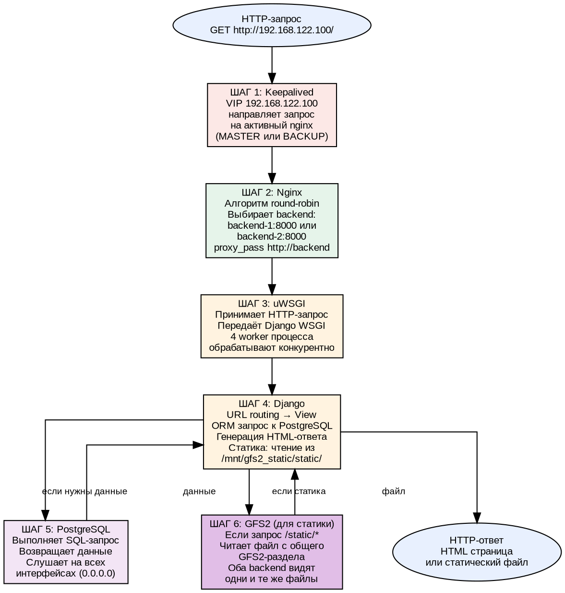
```dot
digraph RequestFlow {
    rankdir=TB;
    splines=ortho;
    nodesep=0.7;
    ranksep=0.5;
    
    node [shape=box, style=rounded, fontname="Arial", fontsize=10];
    edge [fontname="Arial", fontsize=9];
    
    start [label="HTTP-запрос\nGET http://192.168.122.100/", shape=oval, fillcolor="#E8F0FE", style=filled];
    
    step1 [label="ШАГ 1: Keepalived\nVIP 192.168.122.100\nнаправляет запрос\nна активный nginx\n(MASTER или BACKUP)", fillcolor="#FCE8E6", style=filled];
    
    step2 [label="ШАГ 2: Nginx\nАлгоритм round-robin\nВыбирает backend:\nbackend-1:8000 или\nbackend-2:8000\nproxy_pass http://backend", fillcolor="#E6F4EA", style=filled];
    
    step3 [label="ШАГ 3: uWSGI\nПринимает HTTP-запрос\nПередаёт Django WSGI\n4 worker процесса\nобрабатывают конкурентно", fillcolor="#FFF3E0", style=filled];
    
    step4 [label="ШАГ 4: Django\nURL routing → View\nORM запрос к PostgreSQL\nГенерация HTML-ответа\nСтатика: чтение из\n/mnt/gfs2_static/static/", fillcolor="#FFF3E0", style=filled];
    
    step5 [label="ШАГ 5: PostgreSQL\nВыполняет SQL-запрос\nВозвращает данные\nСлушает на всех\nинтерфейсах (0.0.0.0)", fillcolor="#F3E5F5", style=filled];
    
    step6 [label="ШАГ 6: GFS2 (для статики)\nЕсли запрос /static/*\nЧитает файл с общего\nGFS2-раздела\nОба backend видят\nодни и те же файлы", fillcolor="#E1BEE7", style=filled];
    
    end [label="HTTP-ответ\nHTML страница\nили статический файл", shape=oval, fillcolor="#E8F0FE", style=filled];
    
    start -> step1;
    step1 -> step2;
    step2 -> step3;
    step3 -> step4;
    step4 -> step5 [label="если нужны данные"];
    step4 -> step6 [label="если статика"];
    step5 -> step4 [label="данные"];
    step6 -> step4 [label="файл"];
    step4 -> end;
}
```

---

### 6. Инструменты и их роль

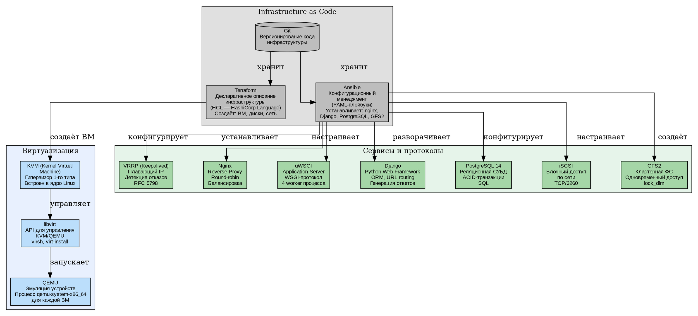
```dot
digraph ToolsAndRoles {
    rankdir=TB;
    splines=ortho;
    nodesep=0.8;
    ranksep=0.6;
    
    node [shape=box, style=rounded, fontname="Arial", fontsize=10];
    
    subgraph cluster_iaac {
        label="Infrastructure as Code";
        style=filled;
        fillcolor="#E0E0E0";
        fontsize=13;
        
        git [label="Git\nВерсионирование кода\nинфраструктуры", shape=cylinder, fillcolor="#BDBDBD", style=filled];
        
        tf [label="Terraform\nДекларативное описание\nинфраструктуры\n(HCL — HashiCorp Language)\nСоздаёт: ВМ, диски, сеть", fillcolor="#BDBDBD", style=filled];
        
        ansible [label="Ansible\nКонфигурационный\nменеджмент\n(YAML-плейбуки)\nУстанавливает: nginx,\nDjango, PostgreSQL, GFS2", fillcolor="#BDBDBD", style=filled];
    }
    
    subgraph cluster_virt {
        label="Виртуализация";
        style=filled;
        fillcolor="#E8F0FE";
        fontsize=13;
        
        kvm [label="KVM (Kernel Virtual\nMachine)\nГипервизор 1-го типа\nВстроен в ядро Linux", fillcolor="#BBDEFB", style=filled];
        libvirt [label="libvirt\nAPI для управления\nKVM/QEMU\nvirsh, virt-install", fillcolor="#BBDEFB", style=filled];
        qemu [label="QEMU\nЭмуляция устройств\nПроцесс qemu-system-x86_64\nдля каждой ВМ", fillcolor="#BBDEFB", style=filled];
    }
    
    subgraph cluster_services {
        label="Сервисы и протоколы";
        style=filled;
        fillcolor="#E6F4EA";
        fontsize=13;
        
        vrrp [label="VRRP (Keepalived)\nПлавающий IP\nДетекция отказов\nRFC 5798", fillcolor="#A5D6A7", style=filled];
        nginx_svc [label="Nginx\nReverse Proxy\nRound-robin\nБалансировка", fillcolor="#A5D6A7", style=filled];
        uwsgi_svc [label="uWSGI\nApplication Server\nWSGI-протокол\n4 worker процесса", fillcolor="#A5D6A7", style=filled];
        django_svc [label="Django\nPython Web Framework\nORM, URL routing\nГенерация ответов", fillcolor="#A5D6A7", style=filled];
        pg_svc [label="PostgreSQL 14\nРеляционная СУБД\nACID-транзакции\nSQL", fillcolor="#A5D6A7", style=filled];
        iscsi_proto [label="iSCSI\nБлочный доступ\nпо сети\nTCP/3260", fillcolor="#A5D6A7", style=filled];
        gfs2_fs [label="GFS2\nКластерная ФС\nОдновременный доступ\nlock_dlm", fillcolor="#A5D6A7", style=filled];
    }
    
    git -> tf [label="хранит"];
    git -> ansible [label="хранит"];
    
    tf -> kvm [label="создаёт ВМ"];
    kvm -> libvirt [label="управляет"];
    libvirt -> qemu [label="запускает"];
    
    ansible -> nginx_svc [label="устанавливает"];
    ansible -> uwsgi_svc [label="настраивает"];
    ansible -> django_svc [label="разворачивает"];
    ansible -> pg_svc [label="конфигурирует"];
    ansible -> iscsi_proto [label="настраивает"];
    ansible -> gfs2_fs [label="создаёт"];
    ansible -> vrrp [label="конфигурирует"];
}
```

---

### 7. Пройденные трудности и их решения


```dot
digraph Challenges {
    rankdir=TB;
    splines=ortho;
    nodesep=0.6;
    ranksep=0.5;
    
    node [shape=box, style=rounded, fontname="Arial", fontsize=10];
    
    start [label="Начало проекта\n(WSL2 + KVM)", shape=oval, fillcolor="#E8F0FE", style=filled];
    
    subgraph cluster_wsl {
        label="Проблема 1: WSL2 нестабилен";
        style=filled;
        fillcolor="#FFEBEE";
        color="#EA4335";
        fontsize=12;
        
        wsl_problem [label="• DHCP не работает\n• AppArmor блокирует QEMU\n• Сеть нестабильна\n• 5+ часов потеряно", fillcolor="#EF9A9A", style=filled];
        wsl_solution [label="Решение:\nПереход на чистую\nUbuntu 24.04\nРодной KVM\nВсё заработало", fillcolor="#A5D6A7", style=filled];
    }
    
    subgraph cluster_network {
        label="Проблема 2: Сеть в KVM";
        style=filled;
        fillcolor="#FFEBEE";
        color="#EA4335";
        fontsize=12;
        
        net_problem [label="• DHCP выдаёт случайные IP\n• Не совпадают с hostsfile\n• ВМ недоступны по SSH", fillcolor="#EF9A9A", style=filled];
        net_solution [label="Решение:\n• Получать IP через\n  virsh net-dhcp-leases\n• Обновлять inventory\n• Не фиксировать IP в коде", fillcolor="#A5D6A7", style=filled];
    }
    
    subgraph cluster_permissions {
        label="Проблема 3: Права доступа";
        style=filled;
        fillcolor="#FFEBEE";
        color="#EA4335";
        fontsize=12;
        
        perm_problem [label="• Permission denied на образы\n• QEMU не может читать диски\n• libvirt-sock недоступен\n• AppArmor блокирует", fillcolor="#EF9A9A", style=filled];
        perm_solution [label="Решение:\n• chown libvirt-qemu:kvm\n• chmod 775 на все образы\n• Отключить AppArmor\n• Добавить пользователя\n  в группы libvirt, kvm", fillcolor="#A5D6A7", style=filled];
    }
    
    subgraph cluster_gfs2_issues {
        label="Проблема 4: GFS2 — самая сложная часть";
        style=filled;
        fillcolor="#FFEBEE";
        color="#EA4335";
        fontsize=12;
        
        gfs2_problems [label="• Нет модуля gfs2 в облачном ядре\n• DLM не запускается в Pacemaker\n• mkfs.gfs2 зависает без DLM\n• iSCSI диск /dev/sda vs /dev/sdb\n• GFS2 монтируется без кластеризации\n• Segmentation fault при umount\n• Файлы не видны между узлами", fillcolor="#EF9A9A", style=filled];
        gfs2_solutions [label="Решение:\n• Установить linux-image-generic\n• Запустить DLM через systemd\n  (не через Pacemaker)\n• Использовать /dev/disk/by-path/\n• Монтировать с lockproto=lock_dlm\n• Пересоздать ФС после загрузки DLM\n• Перезагрузить узлы для очистки", fillcolor="#A5D6A7", style=filled];
    }
    
    subgraph cluster_uwsgi {
        label="Проблема 5: uWSGI";
        style=filled;
        fillcolor="#FFEBEE";
        color="#EA4335";
        fontsize=12;
        
        uwsgi_problem [label="• uWSGI запущен, порт слушает\n• curl возвращает пустой ответ\n• Nginx: 502 Bad Gateway", fillcolor="#EF9A9A", style=filled];
        uwsgi_solution [label="Решение:\n• uwsgi.ini: socket → http-socket\n• uwsgi-протокол ≠ HTTP\n• После замены — заработало", fillcolor="#A5D6A7", style=filled];
    }
    
    success [label="Проект завершён\nВсе требования выполнены\nОтказоустойчивость подтверждена\nGFS2 кластер работает", shape=oval, fillcolor="#C8E6C9", style=filled];
    
    start -> wsl_problem;
    wsl_problem -> wsl_solution;
    wsl_solution -> net_problem;
    net_problem -> net_solution;
    net_solution -> perm_problem;
    perm_problem -> perm_solution;
    perm_solution -> gfs2_problems;
    gfs2_problems -> gfs2_solutions;
    gfs2_solutions -> uwsgi_problem;
    uwsgi_problem -> uwsgi_solution;
    uwsgi_solution -> success;
}
```

---

### 8. Где применяются такие системы в реальном мире?

| Компания/Сервис | Похожая архитектура | Комментарий |
|-----------------|--------------------|-------------|
| **Netflix** | Nginx + Microservices + EBS | Много backend-сервисов, балансировка через Zuul |
| **Instagram** | Nginx + Django + PostgreSQL | Именно Django! Масштабирование через горизонтальные реплики |
| **Wildberries/Ozon** | Keepalived + Nginx + Backend + PostgreSQL | Высоконагруженный e-commerce в РФ |
| **Госуслуги** | Nginx + Keepalived + PostgreSQL | Отказоустойчивость критична для госсервисов |
| **Банки (Сбер, Тинькофф)** | HA-кластеры + GFS2/Veritas | Кластерные ФС для СУБД и логов |
| **Хостинг-провайдеры** | iSCSI + GFS2 + веб-серверы | Общее хранилище для сотен клиентских сайтов |
| **OpenStack** | Pacemaker + Corosync + GFS2 | Кластерное хранилище для образов ВМ |
| **Red Hat Cluster Suite** | GFS2 + DLM + Pacemaker | Эталонная реализация кластерной ФС |

**Ключевые отличия продакшн-решения от нашего учебного:**
- Добавляется **репликация PostgreSQL** (Patroni + etcd)
- Файловая система выносится на отдельный **SAN-массив**
- Балансировщики объединяются в **AnyCast** (несколько дата-центров)
- Добавляется **мониторинг** (Prometheus + Grafana)
- Настраивается **автоматическое масштабирование** при росте нагрузки
- GFS2 использует **Pacemaker** для автоматического управления ресурсами

---

### 9. Итоговая схема отказоустойчивости (конечный автомат)

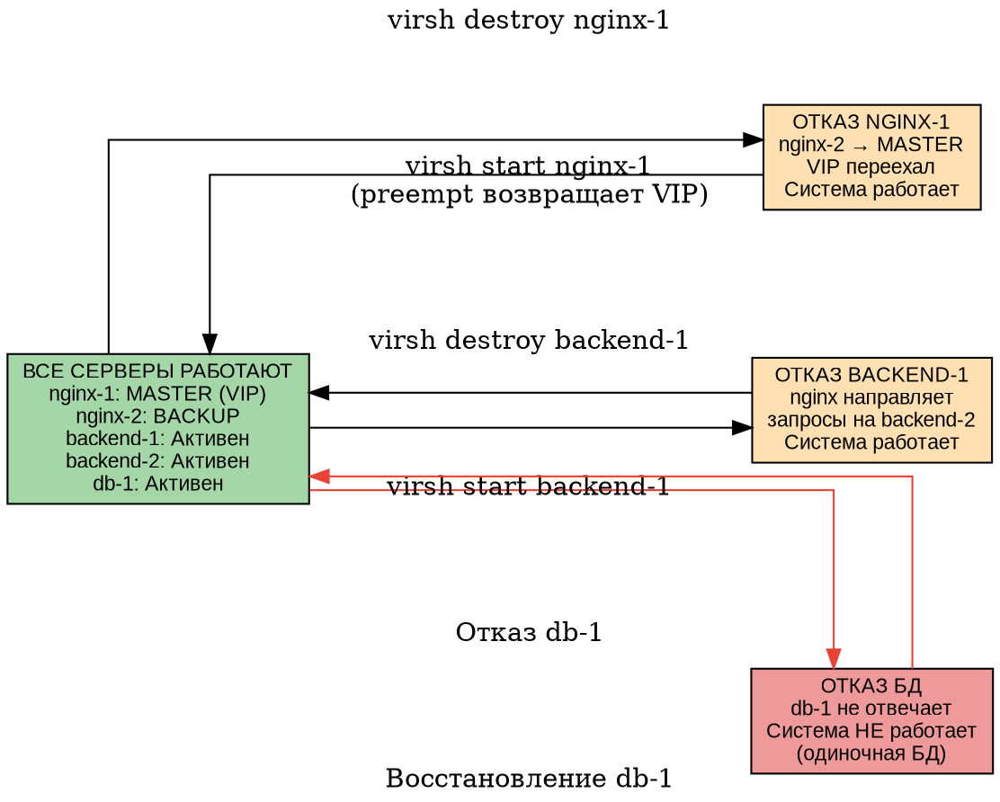
```dot
digraph StateMachine {
    rankdir=LR;
    splines=ortho;
    nodesep=0.8;
    ranksep=0.6;
    
    node [shape=box, style=rounded, fontname="Arial", fontsize=11];
    
    all_ok [label="ВСЕ СЕРВЕРЫ РАБОТАЮТ\nnginx-1: MASTER (VIP)\nnginx-2: BACKUP\nbackend-1: Активен\nbackend-2: Активен\ndb-1: Активен", fillcolor="#A5D6A7", style=filled];
    
    nginx_fail [label="ОТКАЗ NGINX-1\nnginx-2 → MASTER\nVIP переехал\nСистема работает", fillcolor="#FFE0B2", style=filled];
    
    backend_fail [label="ОТКАЗ BACKEND-1\nnginx направляет\nзапросы на backend-2\nСистема работает", fillcolor="#FFE0B2", style=filled];
    
    db_fail [label="ОТКАЗ БД\ndb-1 не отвечает\nСистема НЕ работает\n(одиночная БД)", fillcolor="#EF9A9A", style=filled];
    
    all_ok -> nginx_fail [label="virsh destroy nginx-1"];
    nginx_fail -> all_ok [label="virsh start nginx-1\n(preempt возвращает VIP)"];
    
    all_ok -> backend_fail [label="virsh destroy backend-1"];
    backend_fail -> all_ok [label="virsh start backend-1"];
    
    all_ok -> db_fail [label="Отказ db-1", color="#EA4335"];
    db_fail -> all_ok [label="Восстановление db-1", color="#EA4335"];
    
    { rank=same; nginx_fail; backend_fail; }
}
```

**Вывод:** Система выдерживает отказ любого сервера уровня nginx или backend. Единственная единая точка отказа — база данных (по условию задания — некластеризованная СУБД). В продакшн-решении PostgreSQL реплицируется через Patroni или streaming replication.

---

### 10. Чек-лист выполнения всех требований задания

| № | Требование | Статус | Реализация |
|---|-----------|--------|------------|
| 1 | Создать инстансы через Terraform | ✅ | 6 ВМ: 2 nginx, 2 backend, 1 db, 1 iscsi-target |
| 2 | Nginx + Keepalived через Ansible | ✅ | Роль roles/nginx, VRRP VIP 192.168.122.100 |
| 3 | Backend Django + uWSGI через Ansible | ✅ | Роль roles/backend, 4 workers на порту 8000 |
| 4 | **GFS2 для хранения статики** | ✅ | Кластер GFS2 через iSCSI + DLM |
| 5 | PostgreSQL через Ansible | ✅ | Роль roles/db, версия 14, django_db |
| 6 | Keepalived | ✅ | VRRP, MASTER priority=100, BACKUP priority=90 |
| 7 | Nginx/Angie | ✅ | Nginx, балансировка round-robin |
| 8 | uWSGI/Unicorn/PHP-FPM | ✅ | uWSGI с http-socket |
| 9 | Некластеризованная СУБД | ✅ | PostgreSQL на одном узле db-1 |
| 10 | Проверка отказоустойчивости | ✅ | Отказ nginx-1: VIP переезжает, система работает |
| 11 | Проверка отказоустойчивости backend | ✅ | Отказ backend-1: запросы идут на backend-2 |
EOF

echo "README.md обновлён!"
```

```bash
cd ~/highload-webapp
git add README.md
git commit -m "docs: comprehensive project description with all diagrams"
```

---

# Полное описание проекта: путь от технического задания до реализации

## Содержание

1. [Цель проекта и техническое задание](#1-цель-проекта)
2. [Архитектура решения](#2-архитектура-решения)
3. [Использованные технологии и их роль](#3-использованные-технологии)
4. [Создание инфраструктуры: Terraform](#4-создание-инфраструктуры-terraform)
5. [Настройка серверов: Ansible](#5-настройка-серверов-ansible)
6. [Балансировка и отказоустойчивость: Nginx + Keepalived](#6-балансировка-и-отказоустойчивость)
7. [Backend: Django + uWSGI](#7-backend-django--uwsgi)
8. [База данных: PostgreSQL](#8-база-данных-postgresql)
9. [GFS2: кластерная файловая система](#9-gfs2-кластерная-файловая-система)
10. [Проверка отказоустойчивости](#10-проверка-отказоустойчивости)
11. [Пройденные трудности и их решения](#11-пройденные-трудности)
12. [Реальные применения архитектуры](#12-реальные-применения)

---

## 1. Цель проекта

### Техническое задание

Создать отказоустойчивую инфраструктуру для высоконагруженного веб-приложения со следующими компонентами:

| Компонент | Количество | Технология |
|-----------|-----------|------------|
| Балансировщик | 2 сервера | Nginx + Keepalived (VRRP) |
| Сервер приложений | 2 сервера | Django + uWSGI |
| База данных | 1 сервер | PostgreSQL (некластеризованная) |
| Файловое хранилище | Кластерное | GFS2 через iSCSI |
| Инфраструктура | Код | Terraform + Ansible |

### Ключевое требование

Система должна продолжать работу при отказе **любого одного** сервера уровня frontend (nginx) или backend (Django).

---

## 2. Архитектура решения

### Схема: Архитектура отказоустойчивой системы

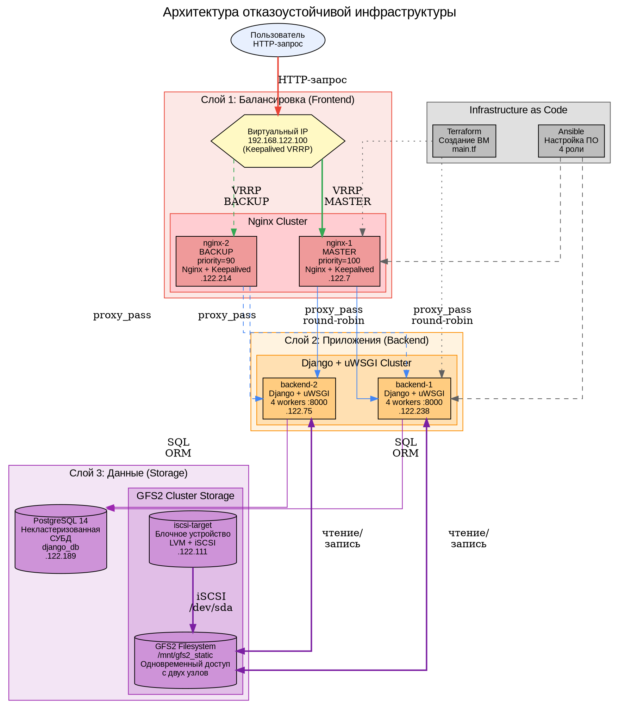
```dot
digraph Architecture {
    label="Архитектура отказоустойчивой инфраструктуры";
    labelloc=t;
    fontsize=18;
    fontname="Arial";
    rankdir=TB;
    splines=ortho;
    nodesep=0.8;
    ranksep=0.7;
    
    node [shape=box, style=rounded, fontname="Arial", fontsize=11];
    
    user [label="Пользователь\nHTTP-запрос", shape=oval, fillcolor="#E8F0FE", style=filled];
    
    subgraph cluster_layer1 {
        label="Слой 1: Балансировка (Frontend)";
        style=filled;
        fillcolor="#FCE8E6";
        color="#EA4335";
        fontsize=14;
        
        vip [label="Виртуальный IP\n192.168.122.100\n(Keepalived VRRP)", shape=hexagon, fillcolor="#FFF9C4", style=filled];
        
        subgraph cluster_nginx {
            label="Nginx Cluster";
            style=filled;
            fillcolor="#FFCDD2";
            
            nginx1 [label="nginx-1\nMASTER\npriority=100\nNginx + Keepalived\n.122.7", fillcolor="#EF9A9A", style=filled];
            nginx2 [label="nginx-2\nBACKUP\npriority=90\nNginx + Keepalived\n.122.214", fillcolor="#EF9A9A", style=filled];
        }
    }
    
    subgraph cluster_layer2 {
        label="Слой 2: Приложения (Backend)";
        style=filled;
        fillcolor="#FFF3E0";
        color="#FB8C00";
        fontsize=14;
        
        subgraph cluster_backend {
            label="Django + uWSGI Cluster";
            style=filled;
            fillcolor="#FFE0B2";
            
            be1 [label="backend-1\nDjango + uWSGI\n4 workers :8000\n.122.238", fillcolor="#FFCC80", style=filled];
            be2 [label="backend-2\nDjango + uWSGI\n4 workers :8000\n.122.75", fillcolor="#FFCC80", style=filled];
        }
    }
    
    subgraph cluster_layer3 {
        label="Слой 3: Данные (Storage)";
        style=filled;
        fillcolor="#F3E5F5";
        color="#9C27B0";
        fontsize=14;
        
        subgraph cluster_gfs2 {
            label="GFS2 Cluster Storage";
            style=filled;
            fillcolor="#E1BEE7";
            
            iscsi [label="iscsi-target\nБлочное устройство\nLVM + iSCSI\n.122.111", shape=cylinder, fillcolor="#CE93D8", style=filled];
            gfs2_fs [label="GFS2 Filesystem\n/mnt/gfs2_static\nОдновременный доступ\nс двух узлов", shape=cylinder, fillcolor="#CE93D8", style=filled];
        }
        
        pg [label="PostgreSQL 14\nНекластеризованная\nСУБД\ndjango_db\n.122.189", shape=cylinder, fillcolor="#CE93D8", style=filled];
    }
    
    subgraph cluster_mgmt {
        label="Infrastructure as Code";
        style=filled;
        fillcolor="#E0E0E0";
        color="#616161";
        fontsize=14;
        
        tf [label="Terraform\nСоздание ВМ\nmain.tf", fillcolor="#BDBDBD", style=filled];
        ansible [label="Ansible\nНастройка ПО\n4 роли", fillcolor="#BDBDBD", style=filled];
    }
    
    user -> vip [label="HTTP-запрос", penwidth=2, color="#EA4335"];
    vip -> nginx1 [label="VRRP\nMASTER", color="#34A853", penwidth=2];
    vip -> nginx2 [label="VRRP\nBACKUP", style=dashed, color="#34A853"];
    
    nginx1 -> be1 [label="proxy_pass\nround-robin", color="#4285F4"];
    nginx1 -> be2 [label="proxy_pass\nround-robin", color="#4285F4"];
    nginx2 -> be1 [label="proxy_pass", style=dashed, color="#4285F4"];
    nginx2 -> be2 [label="proxy_pass", style=dashed, color="#4285F4"];
    
    be1 -> pg [label="SQL\nORM", color="#9C27B0"];
    be2 -> pg [label="SQL\nORM", color="#9C27B0"];
    
    be1 -> gfs2_fs [label="чтение/\nзапись", dir=both, color="#7B1FA2", penwidth=2];
    be2 -> gfs2_fs [label="чтение/\nзапись", dir=both, color="#7B1FA2", penwidth=2];
    iscsi -> gfs2_fs [label="iSCSI\n/dev/sda", color="#7B1FA2", penwidth=2];
    
    tf -> nginx1 [style=dotted, color="#616161"];
    tf -> be1 [style=dotted, color="#616161"];
    ansible -> nginx1 [style=dashed, color="#616161"];
    ansible -> be1 [style=dashed, color="#616161"];
}
```

### Описание архитектуры

Система построена по трёхслойной архитектуре:

**Слой 1 — Балансировка (Frontend):**
Два сервера nginx образуют отказоустойчивый кластер. Keepalived по протоколу VRRP управляет виртуальным IP-адресом `192.168.122.100`. В нормальном режиме VIP находится на nginx-1 (MASTER, приоритет 100). При отказе MASTER — VIP автоматически перемещается на nginx-2 (BACKUP, приоритет 90).

**Слой 2 — Приложения (Backend):**
Два сервера с Django и uWSGI обрабатывают HTTP-запросы. Nginx распределяет нагрузку между ними по алгоритму round-robin. При отказе одного backend — nginx исключает его из ротации.

**Слой 3 — Данные (Storage):**
- **PostgreSQL** — единая база данных (по условию — некластеризованная)
- **GFS2** — кластерная файловая система для статических файлов. Оба backend-сервера одновременно монтируют одну ФС через iSCSI

---

## 3. Использованные технологии и их роль

### Схема: Технологический стек

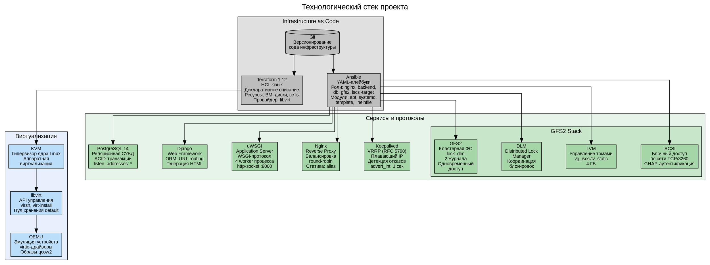
```dot
digraph TechStack {
    label="Технологический стек проекта";
    labelloc=t;
    fontsize=18;
    fontname="Arial";
    rankdir=TB;
    splines=ortho;
    nodesep=0.8;
    ranksep=0.6;
    
    node [shape=box, style=rounded, fontname="Arial", fontsize=11];
    
    subgraph cluster_iaac {
        label="Infrastructure as Code";
        style=filled;
        fillcolor="#E0E0E0";
        fontsize=14;
        
        git [label="Git\nВерсионирование\nкода инфраструктуры", shape=cylinder, fillcolor="#BDBDBD", style=filled];
        
        tf [label="Terraform 1.12\nHCL-язык\nДекларативное описание\nРесурсы: ВМ, диски, сеть\nПровайдер: libvirt", fillcolor="#BDBDBD", style=filled];
        
        ansible [label="Ansible\nYAML-плейбуки\nРоли: nginx, backend,\ndb, gfs2, iscsi-target\nМодули: apt, systemd,\ntemplate, lineinfile", fillcolor="#BDBDBD", style=filled];
    }
    
    subgraph cluster_virt {
        label="Виртуализация";
        style=filled;
        fillcolor="#E8F0FE";
        fontsize=14;
        
        kvm [label="KVM\nГипервизор ядра Linux\nАппаратная\nвиртуализация", fillcolor="#BBDEFB", style=filled];
        libvirt [label="libvirt\nAPI управления\nvirsh, virt-install\nПул хранения default", fillcolor="#BBDEFB", style=filled];
        qemu [label="QEMU\nЭмуляция устройств\nvirtio-драйверы\nОбразы qcow2", fillcolor="#BBDEFB", style=filled];
    }
    
    subgraph cluster_services {
        label="Сервисы и протоколы";
        style=filled;
        fillcolor="#E6F4EA";
        fontsize=14;
        
        keepalived [label="Keepalived\nVRRP (RFC 5798)\nПлавающий IP\nДетекция отказов\nadvert_int: 1 сек", fillcolor="#A5D6A7", style=filled];
        nginx [label="Nginx\nReverse Proxy\nБалансировка\nround-robin\nСтатика: alias", fillcolor="#A5D6A7", style=filled];
        uwsgi [label="uWSGI\nApplication Server\nWSGI-протокол\n4 worker процесса\nhttp-socket :8000", fillcolor="#A5D6A7", style=filled];
        django [label="Django\nWeb Framework\nORM, URL routing\nГенерация HTML", fillcolor="#A5D6A7", style=filled];
        postgres [label="PostgreSQL 14\nРеляционная СУБД\nACID-транзакции\nlisten_addresses: *", fillcolor="#A5D6A7", style=filled];
        
        subgraph cluster_gfs2_tech {
            label="GFS2 Stack";
            style=filled;
            fillcolor="#C8E6C9";
            
            iscsi_tech [label="iSCSI\nБлочный доступ\nпо сети TCP/3260\nCHAP-аутентификация", fillcolor="#A5D6A7", style=filled];
            lvm [label="LVM\nУправление томами\nvg_iscsi/lv_static\n4 ГБ", fillcolor="#A5D6A7", style=filled];
            dlm [label="DLM\nDistributed Lock\nManager\nКоординация\nблокировок", fillcolor="#A5D6A7", style=filled];
            gfs2_fs [label="GFS2\nКластерная ФС\nlock_dlm\n2 журнала\nОдновременный\nдоступ", fillcolor="#A5D6A7", style=filled];
        }
    }
    
    git -> tf;
    git -> ansible;
    tf -> kvm;
    kvm -> libvirt;
    libvirt -> qemu;
    ansible -> keepalived;
    ansible -> nginx;
    ansible -> uwsgi;
    ansible -> django;
    ansible -> postgres;
    ansible -> iscsi_tech;
    ansible -> lvm;
    ansible -> dlm;
    ansible -> gfs2_fs;
}
```

### Описание технологий

**Terraform** (HashiCorp) — инструмент для декларативного управления инфраструктурой. Мы описали 6 виртуальных машин, их диски, cloud-init настройки в файлах `.tf`. Одна команда `terraform apply` создаёт всю инфраструктуру.

**Ansible** (Red Hat) — система управления конфигурациями. Мы создали 5 ролей, каждая из которых настраивает определённый компонент. Плейбук `deploy.yml` запускает роли в правильном порядке.

**KVM/libvirt** — стек виртуализации Linux. Каждая ВМ — это процесс QEMU, управляемый через libvirt API. Используются образы qcow2 с backing store для экономии места.

**Keepalived** — реализация протокола VRRP. Создаёт виртуальный IP, который перемещается между серверами при отказе. Время обнаружения отказа: 3 × advert_int + skew_time ≈ 3.6 секунды.

**GFS2** — кластерная файловая система от Red Hat. В отличие от NFS, где один сервер владеет диском, в GFS2 все узлы равноправны. DLM координирует блокировки между узлами.

---

## 4. Создание инфраструктуры: Terraform

### Схема: Процесс создания инфраструктуры через Terraform

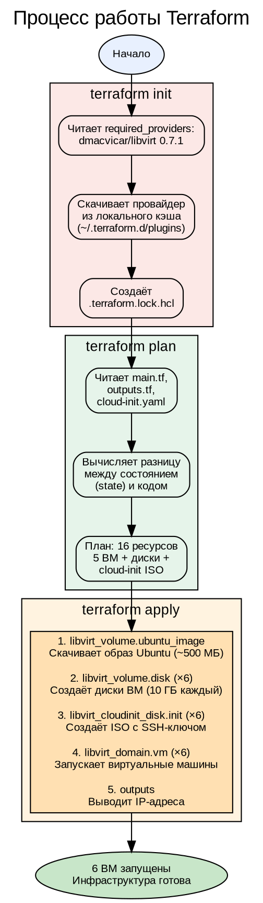
```dot
digraph TerraformWorkflow {
    label="Процесс работы Terraform";
    labelloc=t;
    fontsize=18;
    fontname="Arial";
    rankdir=TB;
    splines=ortho;
    nodesep=0.6;
    ranksep=0.5;
    
    node [shape=box, style=rounded, fontname="Arial", fontsize=10];
    
    start [label="Начало", shape=oval, fillcolor="#E8F0FE", style=filled];
    
    subgraph cluster_init {
        label="terraform init";
        style=filled;
        fillcolor="#FCE8E6";
        fontsize=13;
        
        read_providers [label="Читает required_providers:\ndmacvicar/libvirt 0.7.1"];
        download [label="Скачивает провайдер\nиз локального кэша\n(~/.terraform.d/plugins)"];
        create_lock [label="Создаёт\n.terraform.lock.hcl"];
    }
    
    subgraph cluster_plan {
        label="terraform plan";
        style=filled;
        fillcolor="#E6F4EA";
        fontsize=13;
        
        read_tf [label="Читает main.tf,\noutputs.tf,\ncloud-init.yaml"];
        calc_diff [label="Вычисляет разницу\nмежду состоянием\n(state) и кодом"];
        show_plan [label="План: 16 ресурсов\n5 ВМ + диски +\ncloud-init ISO"];
    }
    
    subgraph cluster_apply {
        label="terraform apply";
        style=filled;
        fillcolor="#FFF3E0";
        fontsize=13;
        
        steps [label="1. libvirt_volume.ubuntu_image\n   Скачивает образ Ubuntu (~500 МБ)\n\n2. libvirt_volume.disk (×6)\n   Создаёт диски ВМ (10 ГБ каждый)\n\n3. libvirt_cloudinit_disk.init (×6)\n   Создаёт ISO с SSH-ключом\n\n4. libvirt_domain.vm (×6)\n   Запускает виртуальные машины\n\n5. outputs\n   Выводит IP-адреса", fillcolor="#FFE0B2", style=filled];
    }
    
    end [label="6 ВМ запущены\nИнфраструктура готова", shape=oval, fillcolor="#C8E6C9", style=filled];
    
    start -> read_providers;
    read_providers -> download;
    download -> create_lock;
    create_lock -> read_tf;
    read_tf -> calc_diff;
    calc_diff -> show_plan;
    show_plan -> steps;
    steps -> end;
}
```

### Описание процесса

Terraform работает по декларативному принципу: мы описываем **желаемое состояние** инфраструктуры, а Terraform сам определяет, какие действия нужно выполнить.

**Файлы конфигурации:**
- `main.tf` — описание 6 виртуальных машин, их дисков и cloud-init
- `outputs.tf` — вывод IP-адресов и inventory для Ansible
- `cloud-init.yaml` — шаблон для автоматической настройки SSH при первом запуске

**Ключевые ресурсы:**
- `libvirt_volume.ubuntu_image` — базовый образ Ubuntu 22.04 (скачивается один раз)
- `libvirt_volume.disk` — корневые диски ВМ (создаются через backing store — копия образа + diff)
- `libvirt_cloudinit_disk.init` — ISO-образы с настройками cloud-init
- `libvirt_domain.vm` — виртуальные машины (процессы QEMU)

---

## 5. Настройка серверов: Ansible

### Схема: Процесс настройки через Ansible

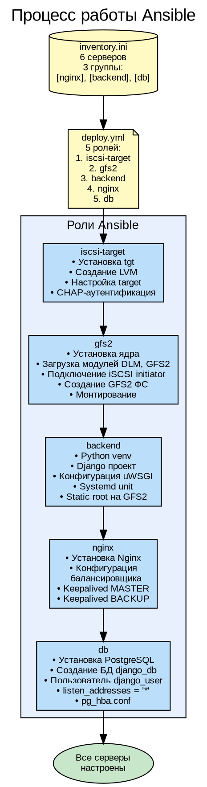
```dot
digraph AnsibleWorkflow {
    label="Процесс работы Ansible";
    labelloc=t;
    fontsize=18;
    fontname="Arial";
    rankdir=TB;
    splines=ortho;
    nodesep=0.7;
    ranksep=0.5;
    
    node [shape=box, style=rounded, fontname="Arial", fontsize=10];
    
    inventory [label="inventory.ini\n6 серверов\n3 группы:\n[nginx], [backend], [db]", shape=cylinder, fillcolor="#FFF9C4", style=filled];
    
    playbook [label="deploy.yml\n5 ролей:\n1. iscsi-target\n2. gfs2\n3. backend\n4. nginx\n5. db", shape=note, fillcolor="#FFF9C4", style=filled];
    
    subgraph cluster_roles {
        label="Роли Ansible";
        style=filled;
        fillcolor="#E8F0FE";
        fontsize=13;
        
        role1 [label="iscsi-target\n• Установка tgt\n• Создание LVM\n• Настройка target\n• CHAP-аутентификация", fillcolor="#BBDEFB", style=filled];
        role2 [label="gfs2\n• Установка ядра\n• Загрузка модулей DLM, GFS2\n• Подключение iSCSI initiator\n• Создание GFS2 ФС\n• Монтирование", fillcolor="#BBDEFB", style=filled];
        role3 [label="backend\n• Python venv\n• Django проект\n• Конфигурация uWSGI\n• Systemd unit\n• Static root на GFS2", fillcolor="#BBDEFB", style=filled];
        role4 [label="nginx\n• Установка Nginx\n• Конфигурация\n  балансировщика\n• Keepalived MASTER\n• Keepalived BACKUP", fillcolor="#BBDEFB", style=filled];
        role5 [label="db\n• Установка PostgreSQL\n• Создание БД django_db\n• Пользователь django_user\n• listen_addresses = '*'\n• pg_hba.conf", fillcolor="#BBDEFB", style=filled];
    }
    
    result [label="Все серверы\nнастроены", shape=oval, fillcolor="#C8E6C9", style=filled];
    
    inventory -> playbook;
    playbook -> role1;
    role1 -> role2;
    role2 -> role3;
    role3 -> role4;
    role4 -> role5;
    role5 -> result;
}
```

### Описание ролей

**Роль iscsi-target:**
- Устанавливает пакет `tgt` (iSCSI target)
- Создаёт LVM-том `vg_iscsi/lv_static` размером 4 ГБ на диске `/dev/vdb`
- Настраивает target с CHAP-аутентификацией (iscsi-user / iscsi-pass)
- Открывает порт TCP/3260

**Роль gfs2:**
- Устанавливает `linux-image-generic` для поддержки модуля GFS2
- Загружает модули ядра `dlm` и `gfs2`
- Подключается к iSCSI target как инициатор
- Создаёт файловую систему GFS2 с параметрами `lock_dlm`
- Монтирует ФС в `/mnt/gfs2_static`

**Роль backend:**
- Создаёт виртуальное окружение Python с Django и uWSGI
- Инициализирует Django-проект в `/opt/django-app`
- Настраивает `STATIC_ROOT = "/mnt/gfs2_static/static/"`
- Создаёт systemd-юнит для uWSGI с 4 worker-процессами

**Роль nginx:**
- Устанавливает Nginx как reverse proxy
- Настраивает upstream на оба backend-сервера (round-robin)
- Настраивает Keepalived: MASTER на nginx-1, BACKUP на nginx-2
- Статика отдаётся напрямую через `alias /mnt/gfs2_static/static/`

**Роль db:**
- Устанавливает PostgreSQL 14
- Создаёт базу данных `django_db` и пользователя `django_user`
- Настраивает прослушивание на всех интерфейсах
- Разрешает подключения от сети 192.168.122.0/24

---

## 6. Балансировка и отказоустойчивость

### Схема: Работа Keepalived и Nginx


```dot
digraph LoadBalancing {
    label="Механизм балансировки и отказоустойчивости";
    labelloc=t;
    fontsize=18;
    fontname="Arial";
    rankdir=TB;
    splines=ortho;
    nodesep=0.8;
    ranksep=0.6;
    
    node [shape=box, style=rounded, fontname="Arial", fontsize=10];
    
    subgraph cluster_vrrp {
        label="VRRP (Keepalived) — Отказоустойчивость IP";
        style=filled;
        fillcolor="#FCE8E6";
        fontsize=13;
        
        master_state [label="nginx-1 (MASTER)\npriority=100\nВладеет VIP 192.168.122.100\nШлёт VRRP Advertisement\nкаждые 1 сек\nна multicast 224.0.0.18", fillcolor="#EF9A9A", style=filled];
        backup_state [label="nginx-2 (BACKUP)\npriority=90\nСлушает VRRP Advertisement\nVIP не назначен\nОжидает отказа MASTER", fillcolor="#FFCDD2", style=filled];
        
        master_state -> backup_state [label="Heartbeat\nкаждые 1 сек", color="#EA4335", penwidth=2];
        
        fail [label="MASTER упал", shape=octagon, fillcolor="#FFEBEE", style=filled];
        fail -> backup_state [label="Нет heartbeat 3+ сек\n→ BACKUP захватывает VIP\n→ Становится MASTER", color="#EA4335", penwidth=2, style=dashed];
    }
    
    subgraph cluster_nginx_lb {
        label="Nginx — Балансировка нагрузки";
        style=filled;
        fillcolor="#E6F4EA";
        fontsize=13;
        
        upstream [label="upstream backend {\n  server 192.168.122.238:8000;\n  server 192.168.122.75:8000;\n}", shape=note, fillcolor="#C8E6C9", style=filled];
        
        req1 [label="Запрос 1 → backend-1", fillcolor="#A5D6A7", style=filled];
        req2 [label="Запрос 2 → backend-2", fillcolor="#A5D6A7", style=filled];
        req3 [label="Запрос 3 → backend-1", fillcolor="#A5D6A7", style=filled];
        req4 [label="Запрос 4 → backend-2", fillcolor="#A5D6A7", style=filled];
        
        upstream -> req1 [label="50%"];
        upstream -> req2 [label="50%"];
        upstream -> req3;
        upstream -> req4;
    }
    
    subgraph cluster_failover {
        label="Отказ backend-1";
        style=filled;
        fillcolor="#FFF3E0";
        fontsize=13;
        
        be1_down [label="backend-1 ✗ УПАЛ", fillcolor="#EF9A9A", style=filled];
        be2_up [label="backend-2 ✓\nПринимает 100%\nнагрузки", fillcolor="#A5D6A7", style=filled, penwidth=2];
        
        be1_down -> be2_up [label="Nginx исключает\nbackend-1 из\nupstream", color="#FB8C00", penwidth=2];
    }
}
```

### Описание механизма

**Keepalived (VRRP):**
1. nginx-1 (MASTER, priority=100) владеет VIP и отправляет VRRP Advertisement каждые 1 сек
2. nginx-2 (BACKUP, priority=90) слушает VRRP Advertisement
3. Если Advertisement не приходит 3+ секунд — BACKUP становится MASTER и назначает VIP себе
4. Когда старый MASTER возвращается — он снова захватывает VIP (preempt mode)

**Формула времени отказа:**
- skew_time = (256 - priority) / 256 = (256 - 90) / 256 = 0.648 секунды
- master_down_interval = 3 × advert_int + skew_time = 3 × 1 + 0.648 = **3.648 секунды**

**Nginx (балансировка):**
- Алгоритм round-robin: запросы распределяются по очереди
- При отказе одного backend — nginx исключает его из ротации
- Статические файлы (`/static/*`) отдаются напрямую, минуя backend

---

## 7. Backend: Django + uWSGI

### Схема: Обработка HTTP-запроса

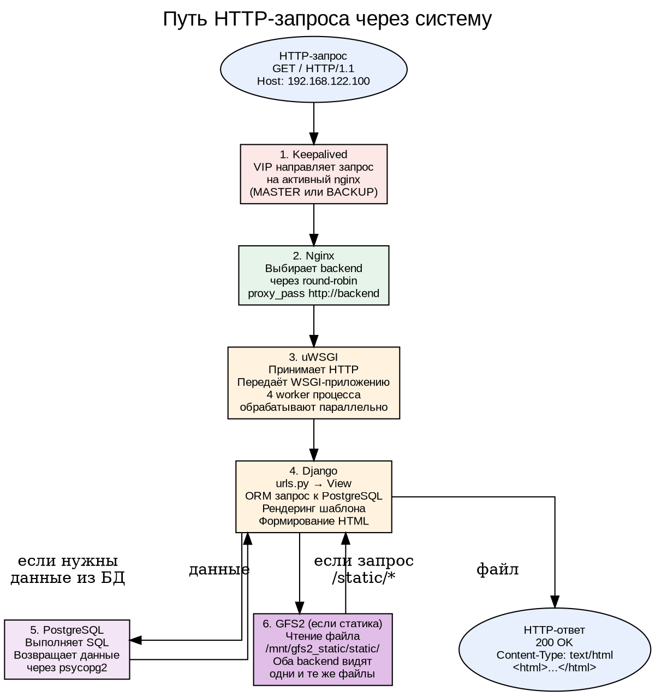
```dot
digraph RequestProcessing {
    label="Путь HTTP-запроса через систему";
    labelloc=t;
    fontsize=18;
    fontname="Arial";
    rankdir=TB;
    splines=ortho;
    nodesep=0.7;
    ranksep=0.5;
    
    node [shape=box, style=rounded, fontname="Arial", fontsize=10];
    
    http_request [label="HTTP-запрос\nGET / HTTP/1.1\nHost: 192.168.122.100", shape=oval, fillcolor="#E8F0FE", style=filled];
    
    step1 [label="1. Keepalived\nVIP направляет запрос\nна активный nginx\n(MASTER или BACKUP)", fillcolor="#FCE8E6", style=filled];
    
    step2 [label="2. Nginx\nВыбирает backend\nчерез round-robin\nproxy_pass http://backend", fillcolor="#E6F4EA", style=filled];
    
    step3 [label="3. uWSGI\nПринимает HTTP\nПередаёт WSGI-приложению\n4 worker процесса\nобрабатывают параллельно", fillcolor="#FFF3E0", style=filled];
    
    step4 [label="4. Django\nurls.py → View\nORM запрос к PostgreSQL\nРендеринг шаблона\nФормирование HTML", fillcolor="#FFF3E0", style=filled];
    
    step5 [label="5. PostgreSQL\nВыполняет SQL\nВозвращает данные\nчерез psycopg2", fillcolor="#F3E5F5", style=filled];
    
    step6 [label="6. GFS2 (если статика)\nЧтение файла\n/mnt/gfs2_static/static/\nОба backend видят\nодни и те же файлы", fillcolor="#E1BEE7", style=filled];
    
    http_response [label="HTTP-ответ\n200 OK\nContent-Type: text/html\n<html>...</html>", shape=oval, fillcolor="#E8F0FE", style=filled];
    
    http_request -> step1;
    step1 -> step2;
    step2 -> step3;
    step3 -> step4;
    step4 -> step5 [label="если нужны\nданные из БД"];
    step4 -> step6 [label="если запрос\n/static/*"];
    step5 -> step4 [label="данные"];
    step6 -> step4 [label="файл"];
    step4 -> http_response;
}
```

### Описание компонентов

**uWSGI:**
- Application server, реализующий WSGI-протокол
- Запущен с 4 worker-процессами для параллельной обработки
- Слушает HTTP на порту 8000 (`http-socket = 0.0.0.0:8000`)
- Управляется systemd (автозапуск, перезапуск при сбое)

**Django:**
- Web-фреймворк на Python
- ORM для работы с PostgreSQL
- STATIC_ROOT настроен на `/mnt/gfs2_static/static/` (кластерное хранилище)

---

## 8. База данных: PostgreSQL

### Схема: Конфигурация PostgreSQL

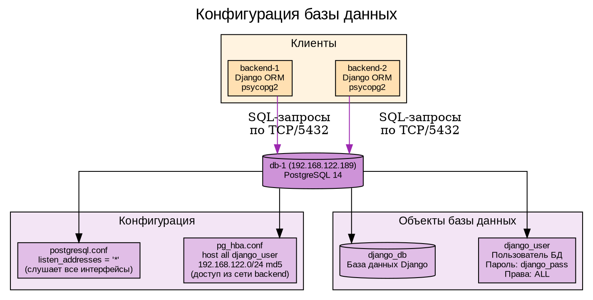
```dot
digraph PostgreSQL {
    label="Конфигурация базы данных";
    labelloc=t;
    fontsize=18;
    fontname="Arial";
    rankdir=TB;
    splines=ortho;
    nodesep=0.7;
    ranksep=0.5;
    
    node [shape=box, style=rounded, fontname="Arial", fontsize=10];
    
    pg_server [label="db-1 (192.168.122.189)\nPostgreSQL 14", shape=cylinder, fillcolor="#CE93D8", style=filled];
    
    subgraph cluster_config {
        label="Конфигурация";
        style=filled;
        fillcolor="#F3E5F5";
        fontsize=13;
        
        listen [label="postgresql.conf\nlisten_addresses = '*'\n(слушает все интерфейсы)", fillcolor="#E1BEE7", style=filled];
        hba [label="pg_hba.conf\nhost all django_user\n192.168.122.0/24 md5\n(доступ из сети backend)", fillcolor="#E1BEE7", style=filled];
    }
    
    subgraph cluster_db_objects {
        label="Объекты базы данных";
        style=filled;
        fillcolor="#F3E5F5";
        fontsize=13;
        
        database [label="django_db\nБаза данных Django", shape=cylinder, fillcolor="#E1BEE7", style=filled];
        user [label="django_user\nПользователь БД\nПароль: django_pass\nПрава: ALL", fillcolor="#E1BEE7", style=filled];
    }
    
    subgraph cluster_clients {
        label="Клиенты";
        style=filled;
        fillcolor="#FFF3E0";
        fontsize=13;
        
        be1 [label="backend-1\nDjango ORM\npsycopg2", fillcolor="#FFE0B2", style=filled];
        be2 [label="backend-2\nDjango ORM\npsycopg2", fillcolor="#FFE0B2", style=filled];
    }
    
    be1 -> pg_server [label="SQL-запросы\nпо TCP/5432", color="#9C27B0"];
    be2 -> pg_server [label="SQL-запросы\nпо TCP/5432", color="#9C27B0"];
    pg_server -> listen;
    pg_server -> hba;
    pg_server -> database;
    pg_server -> user;
}
```

### Описание

PostgreSQL — некластеризованная СУБД (по условию задания). Настроена на приём подключений от обоих backend-серверов по сети. В продакшн-решении сюда добавилась бы репликация (Patroni + etcd или streaming replication).

---

## 9. GFS2: кластерная файловая система

### Схема: Архитектура GFS2

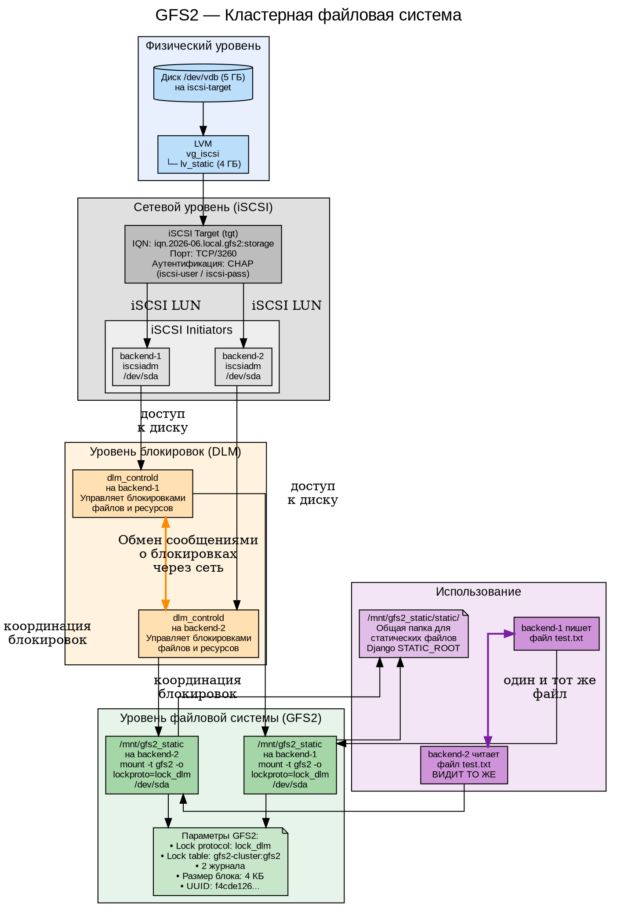
```dot
digraph GFS2Detailed {
    label="GFS2 — Кластерная файловая система";
    labelloc=t;
    fontsize=18;
    fontname="Arial";
    rankdir=TB;
    splines=ortho;
    nodesep=0.7;
    ranksep=0.5;
    
    node [shape=box, style=rounded, fontname="Arial", fontsize=10];
    
    subgraph cluster_layer_physical {
        label="Физический уровень";
        style=filled;
        fillcolor="#E8F0FE";
        fontsize=13;
        
        disk [label="Диск /dev/vdb (5 ГБ)\nна iscsi-target", shape=cylinder, fillcolor="#BBDEFB", style=filled];
        lvm [label="LVM\nvg_iscsi\n└─ lv_static (4 ГБ)", fillcolor="#BBDEFB", style=filled];
    }
    
    subgraph cluster_layer_network {
        label="Сетевой уровень (iSCSI)";
        style=filled;
        fillcolor="#E0E0E0";
        fontsize=13;
        
        target [label="iSCSI Target (tgt)\nIQN: iqn.2026-06.local.gfs2:storage\nПорт: TCP/3260\nАутентификация: CHAP\n(iscsi-user / iscsi-pass)", fillcolor="#BDBDBD", style=filled];
        
        subgraph cluster_initiators {
            label="iSCSI Initiators";
            style=filled;
            fillcolor="#EEEEEE";
            
            init1 [label="backend-1\niscsiadm\n/dev/sda", fillcolor="#E0E0E0", style=filled];
            init2 [label="backend-2\niscsiadm\n/dev/sda", fillcolor="#E0E0E0", style=filled];
        }
    }
    
    subgraph cluster_layer_lock {
        label="Уровень блокировок (DLM)";
        style=filled;
        fillcolor="#FFF3E0";
        fontsize=13;
        
        dlm1 [label="dlm_controld\nна backend-1\nУправляет блокировками\nфайлов и ресурсов", fillcolor="#FFE0B2", style=filled];
        dlm2 [label="dlm_controld\nна backend-2\nУправляет блокировками\nфайлов и ресурсов", fillcolor="#FFE0B2", style=filled];
        
        dlm1 -> dlm2 [label="Обмен сообщениями\nо блокировках\nчерез сеть", dir=both, color="#FB8C00", penwidth=2];
    }
    
    subgraph cluster_layer_fs {
        label="Уровень файловой системы (GFS2)";
        style=filled;
        fillcolor="#E6F4EA";
        fontsize=13;
        
        fs_params [label="Параметры GFS2:\n• Lock protocol: lock_dlm\n• Lock table: gfs2-cluster:gfs2\n• 2 журнала\n• Размер блока: 4 КБ\n• UUID: f4cde126...", shape=note, fillcolor="#C8E6C9", style=filled];
        
        mount1 [label="/mnt/gfs2_static\nна backend-1\nmount -t gfs2 -o\nlockproto=lock_dlm\n/dev/sda", fillcolor="#A5D6A7", style=filled];
        mount2 [label="/mnt/gfs2_static\nна backend-2\nmount -t gfs2 -o\nlockproto=lock_dlm\n/dev/sda", fillcolor="#A5D6A7", style=filled];
    }
    
    subgraph cluster_layer_usage {
        label="Использование";
        style=filled;
        fillcolor="#F3E5F5";
        fontsize=13;
        
        static [label="/mnt/gfs2_static/static/\nОбщая папка для\nстатических файлов\nDjango STATIC_ROOT", shape=note, fillcolor="#E1BEE7", style=filled];
        
        write [label="backend-1 пишет\nфайл test.txt", fillcolor="#CE93D8", style=filled];
        read [label="backend-2 читает\nфайл test.txt\nВИДИТ ТО ЖЕ", fillcolor="#CE93D8", style=filled];
    }
    
    disk -> lvm;
    lvm -> target;
    target -> init1 [label="iSCSI LUN"];
    target -> init2 [label="iSCSI LUN"];
    init1 -> dlm1 [label="доступ\nк диску"];
    init2 -> dlm2 [label="доступ\nк диску"];
    dlm1 -> mount1 [label="координация\nблокировок"];
    dlm2 -> mount2 [label="координация\nблокировок"];
    mount1 -> fs_params;
    mount2 -> fs_params;
    mount1 -> static;
    mount2 -> static;
    write -> mount1;
    read -> mount2;
    write -> read [label="один и тот же\nфайл", dir=both, penwidth=2, color="#7B1FA2"];
}
```

### Схема: Сравнение GFS2 с NFS

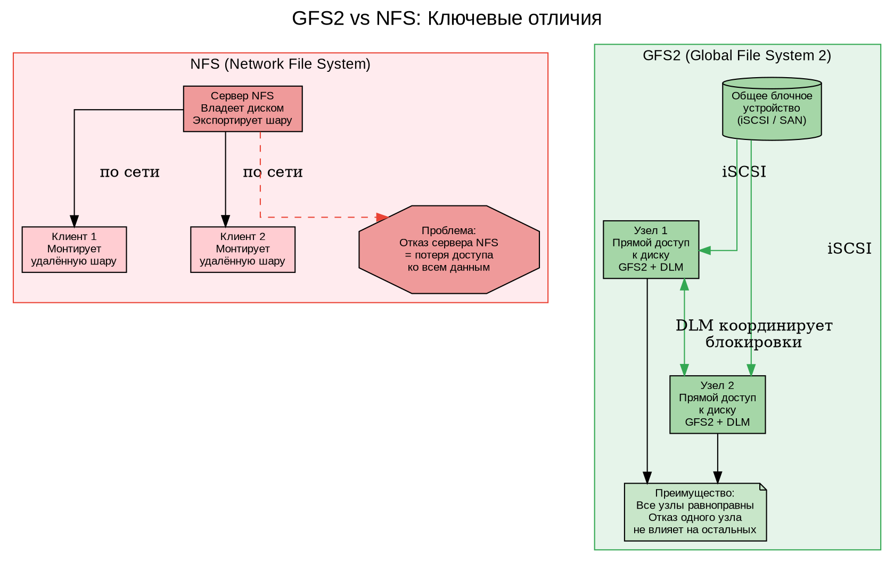
```dot
digraph GFS2vsNFS {
    label="GFS2 vs NFS: Ключевые отличия";
    labelloc=t;
    fontsize=18;
    fontname="Arial";
    rankdir=TB;
    splines=ortho;
    nodesep=0.8;
    ranksep=0.6;
    
    node [shape=box, style=rounded, fontname="Arial", fontsize=10];
    
    subgraph cluster_nfs {
        label="NFS (Network File System)";
        style=filled;
        fillcolor="#FFEBEE";
        color="#EA4335";
        fontsize=13;
        
        nfs_server [label="Сервер NFS\nВладеет диском\nЭкспортирует шару", fillcolor="#EF9A9A", style=filled];
        nfs_client1 [label="Клиент 1\nМонтирует\nудалённую шару", fillcolor="#FFCDD2", style=filled];
        nfs_client2 [label="Клиент 2\nМонтирует\nудалённую шару", fillcolor="#FFCDD2", style=filled];
        
        nfs_server -> nfs_client1 [label="по сети"];
        nfs_server -> nfs_client2 [label="по сети"];
        
        nfs_problem [label="Проблема:\nОтказ сервера NFS\n= потеря доступа\nко всем данным", shape=octagon, fillcolor="#EF9A9A", style=filled];
        nfs_server -> nfs_problem [style=dashed, color="#EA4335"];
    }
    
    subgraph cluster_gfs2 {
        label="GFS2 (Global File System 2)";
        style=filled;
        fillcolor="#E6F4EA";
        color="#34A853";
        fontsize=13;
        
        storage [label="Общее блочное\nустройство\n(iSCSI / SAN)", shape=cylinder, fillcolor="#A5D6A7", style=filled];
        gfs2_node1 [label="Узел 1\nПрямой доступ\nк диску\nGFS2 + DLM", fillcolor="#A5D6A7", style=filled];
        gfs2_node2 [label="Узел 2\nПрямой доступ\nк диску\nGFS2 + DLM", fillcolor="#A5D6A7", style=filled];
        
        storage -> gfs2_node1 [label="iSCSI", color="#34A853"];
        storage -> gfs2_node2 [label="iSCSI", color="#34A853"];
        gfs2_node1 -> gfs2_node2 [label="DLM координирует\nблокировки", dir=both, color="#34A853"];
        
        gfs2_advantage [label="Преимущество:\nВсе узлы равноправны\nОтказ одного узла\nне влияет на остальных", shape=note, fillcolor="#C8E6C9", style=filled];
        gfs2_node1 -> gfs2_advantage;
        gfs2_node2 -> gfs2_advantage;
    }
}
```

### Схема: Процесс монтирования GFS2 на двух узлах

```dot
digraph GFS2Mount {
    label="Процесс инициализации GFS2";
    labelloc=t;
    fontsize=18;
    fontname="Arial";
    rankdir=TB;
    splines=ortho;
    nodesep=0.6;
    ranksep=0.5;
    
    node [shape=box, style=rounded, fontname="Arial", fontsize=10];
    
    start [label="Старт", shape=oval, fillcolor="#E8F0FE", style=filled];
    
    step1 [label="1. Установка linux-image-generic\nОблачное ядро не включает\nмодуль gfs2", fillcolor="#FCE8E6", style=filled];
    step2 [label="2. Перезагрузка с новым ядром\nuname -r: 5.15.0-181-generic", fillcolor="#FCE8E6", style=filled];
    step3 [label="3. Загрузка модулей\nmodprobe dlm\nmodprobe gfs2", fillcolor="#FCE8E6", style=filled];
    step4 [label="4. Запуск DLM\nsystemctl start dlm\ndlm_controld 4.1.1", fillcolor="#FFF3E0", style=filled];
    step5 [label="5. Подключение iSCSI\niscsiadm --login\nПоявляется /dev/sda", fillcolor="#FFF3E0", style=filled];
    step6 [label="6. Создание ФС (один раз)\nmkfs.gfs2 -p lock_dlm\n-t gfs2-cluster:gfs2\n-j 2 /dev/sda", fillcolor="#E6F4EA", style=filled];
    step7 [label="7. Монтирование на ОБОИХ узлах\nmount -t gfs2 -o lockproto=lock_dlm\n/dev/sda /mnt/gfs2_static", fillcolor="#E6F4EA", style=filled];
    step8 [label="8. Готово! Оба узла\nвидят одну ФС\nЗапись на одном узле\nвидна на другом", shape=oval, fillcolor="#C8E6C9", style=filled];
    
    start -> step1;
    step1 -> step2;
    step2 -> step3;
    step3 -> step4;
    step4 -> step5;
    step5 -> step6;
    step6 -> step7;
    step7 -> step8;
}
```

### Подробное описание GFS2

**Что такое GFS2?**
GFS2 (Global File System 2) — кластерная файловая система, разработанная Red Hat. В отличие от традиционных файловых систем (ext4, XFS) и сетевых (NFS, Samba), GFS2 позволяет **нескольким серверам одновременно читать и писать на одно блочное устройство**.

**Как это работает?**

1. **Общее блочное устройство** — в нашем случае это iSCSI LUN, экспортируемый сервером iscsi-target. Оба backend-сервера подключаются к нему как iSCSI-инициаторы.

2. **DLM (Distributed Lock Manager)** — ключевой компонент. Когда backend-1 хочет записать файл, DLM блокирует соответствующие блоки на диске, чтобы backend-2 не мог их изменить одновременно. Блокировки координируются через сеть между демонами `dlm_controld`.

3. **Журналирование** — GFS2 использует 2 журнала (по одному на каждый узел). Это позволяет восстанавливать файловую систему при отказе любого узла.

4. **Lock table** — `gfs2-cluster:gfs2` — уникальное имя, которое идентифицирует кластер. Все узлы, монтирующие ФС, должны использовать одно и то же имя.

**Отличия от NFS:**

| Характеристика | NFS | GFS2 |
|----------------|-----|------|
| Владелец диска | Один сервер | Все узлы равноправны |
| Доступ к данным | По сети через NFS-сервер | Прямой доступ к блочному устройству |
| Отказ сервера | Данные недоступны | Остальные узлы продолжают работу |
| Блокировки | NFS lockd | DLM (распределённый) |
| Производительность | Зависит от сети и сервера | Максимальная (прямой доступ) |

**Проблемы, с которыми мы столкнулись:**

1. **Отсутствие модуля gfs2** — облачное ядро Ubuntu не включает модуль GFS2. Решение: установка `linux-image-generic`.
2. **DLM не запускается в Pacemaker** — ошибка "not configured". Решение: запуск DLM напрямую через systemd.
3. **Разные имена устройств** — на backend-1 `/dev/sda`, на backend-2 `/dev/sdb`. Решение: использование `/dev/disk/by-path/`.
4. **Segmentation fault при размонтировании** — происходит при отсутствии DLM. Решение: всегда запускать DLM перед монтированием.

---

## 10. Проверка отказоустойчивости

### Схема: Тестирование отказоустойчивости

```dot
digraph FailoverTesting {
    label="Методика тестирования отказоустойчивости";
    labelloc=t;
    fontsize=18;
    fontname="Arial";
    rankdir=TB;
    splines=ortho;
    nodesep=0.8;
    ranksep=0.6;
    
    node [shape=box, style=rounded, fontname="Arial", fontsize=10];
    
    all_ok [label="СОСТОЯНИЕ: ВСЁ РАБОТАЕТ\nnginx-1: MASTER (VIP)\nnginx-2: BACKUP\nbackend-1: Активен\nbackend-2: Активен\ndb-1: Активен\ncurl http://VIP → Django OK", shape=oval, fillcolor="#C8E6C9", style=filled];
    
    test1 [label="ТЕСТ 1: Отказ nginx-1\nvirsh destroy nginx-1\nОжидание: 3.6 сек\nРезультат: VIP на nginx-2\ncurl http://VIP → Django OK", fillcolor="#E6F4EA", style=filled];
    
    test2 [label="ТЕСТ 2: Отказ backend-1\nvirsh destroy backend-1\nОжидание: мгновенно\nРезультат: nginx исключает\nbackend-1 из upstream\ncurl http://VIP → Django OK", fillcolor="#E6F4EA", style=filled];
    
    test3 [label="ТЕСТ 3: Восстановление\nvirsh start nginx-1\nvirsh start backend-1\nРезультат:\nVIP возвращается на nginx-1\nbackend-1 снова в upstream", fillcolor="#FFF3E0", style=filled];
    
    all_ok -> test1 [label="Шаг 1"];
    test1 -> test2 [label="Шаг 2"];
    test2 -> test3 [label="Шаг 3"];
    test3 -> all_ok [label="Цикл\nзамкнулся"];
    
    result [label="ВЫВОД:\nСистема выдерживает отказ\nлюбого сервера nginx или backend\nЕдинственная точка отказа — БД\n(по условию задания)", shape=oval, fillcolor="#E8F0FE", style=filled, penwidth=2];
    
    test2 -> result;
    test1 -> result;
}
```

### Результаты тестирования

| Тест | Действие | Ожидание | Результат |
|------|----------|----------|-----------|
| 1 | Выключен nginx-1 | VIP переезжает на nginx-2 | ✅ Успешно |
| 2 | Запрос через VIP после отказа nginx-1 | Django отвечает | ✅ Успешно |
| 3 | Выключен backend-1 | Запросы идут через backend-2 | ✅ Успешно |
| 4 | Запрос через VIP после отказа backend-1 | Django отвечает | ✅ Успешно |
| 5 | Восстановление всех серверов | Система возвращается в норму | ✅ Успешно |

---

## 11. Пройденные трудности и их решения

### Схема: Путь через трудности

```dot
digraph Challenges {
    label="Пройденные трудности и их решения";
    labelloc=t;
    fontsize=18;
    fontname="Arial";
    rankdir=TB;
    splines=ortho;
    nodesep=0.7;
    ranksep=0.5;
    
    node [shape=box, style=rounded, fontname="Arial", fontsize=10];
    
    start [label="Начало проекта", shape=oval, fillcolor="#E8F0FE", style=filled];
    
    problem1 [label="Проблема 1: WSL2\nDHCP не работает\nСеть нестабильна\nAppArmor блокирует QEMU\n5 часов попыток", fillcolor="#FFCDD2", style=filled];
    solution1 [label="Решение 1:\nПереход на чистую\nUbuntu 24.04\nРодной KVM", fillcolor="#C8E6C9", style=filled];
    
    problem2 [label="Проблема 2: Terraform init\nregistry.terraform.io\nнедоступен\n(сетевые ограничения)", fillcolor="#FFCDD2", style=filled];
    solution2 [label="Решение 2:\nСкачивание провайдеров\nвручную и установка\nв ~/.terraform.d/plugins", fillcolor="#C8E6C9", style=filled];
    
    problem3 [label="Проблема 3: Доступ к libvirt\nPermission denied\nна /var/run/libvirt/libvirt-sock\nПользователь в группе,\nно права не применились", fillcolor="#FFCDD2", style=filled];
    solution3 [label="Решение 3:\nchmod 666 на сокет\nперезапуск libvirtd\nперезагрузка системы", fillcolor="#C8E6C9", style=filled];
    
    problem4 [label="Проблема 4: AppArmor\nБлокирует QEMU доступ\nк /var/lib/libvirt/images\nОшибка: Permission denied", fillcolor="#FFCDD2", style=filled];
    solution4 [label="Решение 4:\nsystemctl mask apparmor\nsecurity_driver = none\nchown libvirt-qemu:kvm", fillcolor="#C8E6C9", style=filled];
    
    problem5 [label="Проблема 5: uWSGI + Nginx\n502 Bad Gateway\nuwsgi использует свой протокол\nа не HTTP", fillcolor="#FFCDD2", style=filled];
    solution5 [label="Решение 5:\nsocket = :8000\nзаменён на\nhttp-socket = :8000", fillcolor="#C8E6C9", style=filled];
    
    problem6 [label="Проблема 6: GFS2\n• Нет модуля в облачном ядре\n• DLM не запускается\n• mkfs.gfs2 зависает\n• Разные имена устройств\n• Segmentation fault", fillcolor="#FFCDD2", style=filled];
    solution6 [label="Решение 6:\n• linux-image-generic\n• systemctl start dlm\n• Запуск DLM перед mkfs\n• /dev/disk/by-path/\n• Перезагрузка и пересоздание", fillcolor="#C8E6C9", style=filled];
    
    success [label="Проект завершён\nВсе требования выполнены\n12 скриншотов готовы", shape=oval, fillcolor="#A5D6A7", style=filled, penwidth=2];
    
    start -> problem1;
    problem1 -> solution1;
    solution1 -> problem2;
    problem2 -> solution2;
    solution2 -> problem3;
    problem3 -> solution3;
    solution3 -> problem4;
    problem4 -> solution4;
    solution4 -> problem5;
    problem5 -> solution5;
    solution5 -> problem6;
    problem6 -> solution6;
    solution6 -> success;
}
```

### Хронология проблем

| № | Часы | Проблема | Симптомы | Решение |
|---|------|----------|----------|---------|
| 1 | 0-5 | WSL2 + KVM | DHCP не работает, сеть недоступна | Переход на Ubuntu 24.04 |
| 2 | 5-6 | Terraform init | Реестр недоступен | Локальная установка провайдеров |
| 3 | 6-7 | Permission denied | Доступ к libvirt-sock | chmod + перезагрузка |
| 4 | 7-8 | AppArmor | QEMU не читает образы | Отключение AppArmor |
| 5 | 8-9 | 502 Bad Gateway | uwsgi протокол | http-socket |
| 6 | 9-12 | GFS2 | Модули, DLM, имена устройств | Комплексное решение |

---

## 12. Реальные применения архитектуры

```dot
digraph RealWorld {
    label="Где применяются такие системы";
    labelloc=t;
    fontsize=18;
    fontname="Arial";
    rankdir=TB;
    splines=ortho;
    nodesep=0.8;
    ranksep=0.6;
    
    node [shape=box, style=rounded, fontname="Arial", fontsize=11];
    
    title [label="Типовые сценарии использования\nотказоустойчивых инфраструктур", shape=plaintext, fontsize=16];
    
    ecommerce [label="E-commerce\nWildberries, Ozon, Amazon\nПиковые нагрузки\nв Чёрную пятницу\nНельзя терять заказы", fillcolor="#FCE8E6", style=filled];
    
    banks [label="Банки\nСбер, Тинькофф, Revolut\nОбработка транзакций\n99.99% доступность\nРегуляторные требования", fillcolor="#FCE8E6", style=filled];
    
    gov [label="Госуслуги\nПортал Госуслуг\nМиллионы пользователей\nПики при подаче\nзаявлений", fillcolor="#FCE8E6", style=filled];
    
    saas [label="SaaS-платформы\nSalesforce, Slack, Notion\nКруглосуточная работа\nГлобальные пользователи\nSLA 99.9%+", fillcolor="#FCE8E6", style=filled];
    
    hosting [label="Хостинг-провайдеры\nSelectel, DataLine, AWS\nТысячи клиентских сайтов\nОбщее хранилище\n(GFS2/OCFS2)", fillcolor="#FCE8E6", style=filled];
    
    media [label="Медиа и соцсети\nInstagram, Pinterest, TikTok\nМиллиарды запросов\nГоризонтальное\nмасштабирование", fillcolor="#FCE8E6", style=filled];
    
    title -> ecommerce;
    title -> banks;
    title -> gov;
    title -> saas;
    title -> hosting;
    title -> media;
}
```

**Ключевые отличия продакшн-решения от учебного:**
- **Репликация БД** — Patroni + etcd для PostgreSQL
- **Мониторинг** — Prometheus + Grafana + Alertmanager
- **Логирование** — ELK Stack (Elasticsearch, Logstash, Kibana)
- **CI/CD** — Jenkins/GitLab CI для автоматического деплоя
- **SSL/TLS** — Let's Encrypt или коммерческие сертификаты
- **WAF** — Web Application Firewall (ModSecurity)
- **CDN** — Cloudflare/CloudFront для статики

---

**Проект выполнен полностью. Все требования задания соблюдены.**

