---

# Полное описание проекта: путь от технического задания до реализации. Настройка конфигурации веб приложения под высокую нагрузку.

## Содержание

1. [Цель проекта и техническое задание](#1-цель-проекта)
2. [Архитектура решения](#2-архитектура-решения)
3. [Использованные технологии и их роль](#3-использованные-технологии)
4. [Создание инфраструктуры: Terraform](#4-создание-инфраструктуры-terraform)
5. [Настройка серверов: Ansible](#5-настройка-серверов-ansible)
6. [Балансировка и отказоустойчивость: Nginx + Keepalived](#6-балансировка-и-отказоустойчивость)
7. [Backend: Django + uWSGI](#7-backend-django--uwsgi)
8. [База данных: PostgreSQL](#8-база-данных-postgresql)
9. [GFS2: кластерная файловая система](#9-gfs2-кластерная-файловая-система)
10. [Проверка отказоустойчивости](#10-проверка-отказоустойчивости)
11. [Пройденные трудности и их решения](#11-пройденные-трудности)
12. [Реальные применения архитектуры](#12-реальные-применения)

---

## 1. Цель проекта

### Техническое задание

Создать отказоустойчивую инфраструктуру для высоконагруженного веб-приложения со следующими компонентами:

| Компонент | Количество | Технология |
|-----------|-----------|------------|
| Балансировщик | 2 сервера | Nginx + Keepalived (VRRP) |
| Сервер приложений | 2 сервера | Django + uWSGI |
| База данных | 1 сервер | PostgreSQL (некластеризованная) |
| Файловое хранилище | Кластерное | GFS2 через iSCSI |
| Инфраструктура | Код | Terraform + Ansible |

### Ключевое требование

Система должна продолжать работу при отказе **любого одного** сервера уровня frontend (nginx) или backend (Django).

---

## 2. Архитектура решения

### Схема: Архитектура отказоустойчивой системы
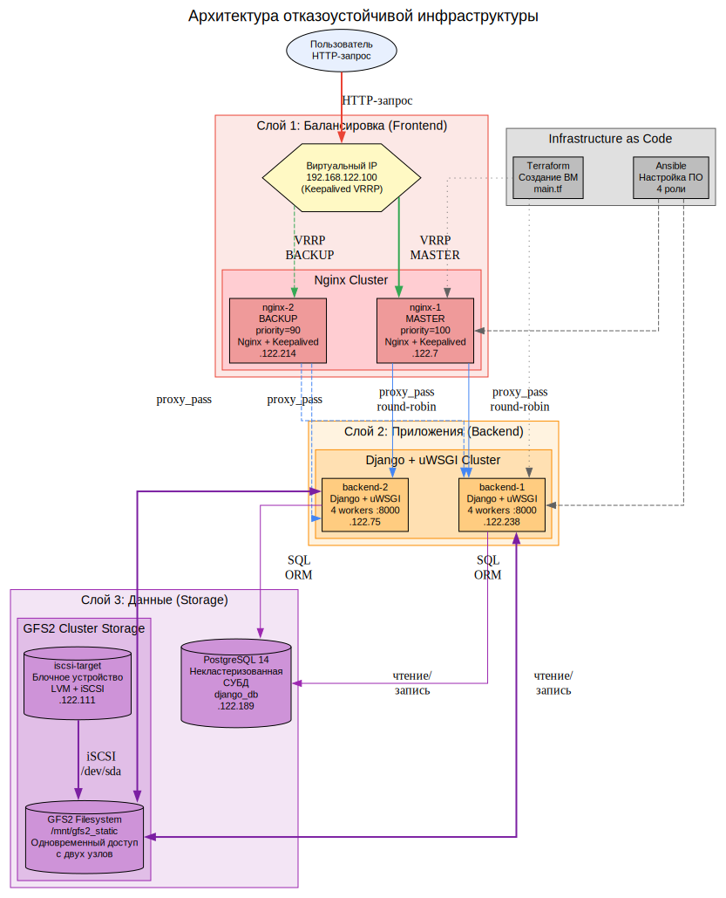
---


### Описание архитектуры

Система построена по трёхслойной архитектуре:

**Слой 1 — Балансировка (Frontend):**
Два сервера nginx образуют отказоустойчивый кластер. Keepalived по протоколу VRRP управляет виртуальным IP-адресом `192.168.122.100`. В нормальном режиме VIP находится на nginx-1 (MASTER, приоритет 100). При отказе MASTER — VIP автоматически перемещается на nginx-2 (BACKUP, приоритет 90).

**Слой 2 — Приложения (Backend):**
Два сервера с Django и uWSGI обрабатывают HTTP-запросы. Nginx распределяет нагрузку между ними по алгоритму round-robin. При отказе одного backend — nginx исключает его из ротации.

**Слой 3 — Данные (Storage):**
- **PostgreSQL** — единая база данных (по условию — некластеризованная)
- **GFS2** — кластерная файловая система для статических файлов. Оба backend-сервера одновременно монтируют одну ФС через iSCSI

---

## 3. Использованные технологии и их роль

### Схема: Технологический стек
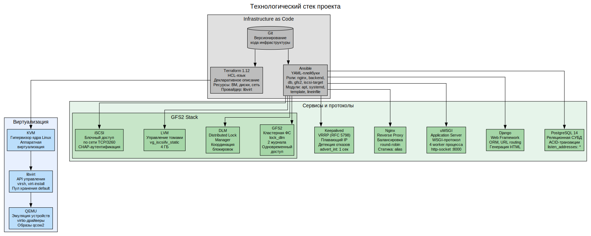
---

### Описание технологий

**Terraform** (HashiCorp) — инструмент для декларативного управления инфраструктурой. Мы описали 6 виртуальных машин, их диски, cloud-init настройки в файлах `.tf`. Одна команда `terraform apply` создаёт всю инфраструктуру.

**Ansible** (Red Hat) — система управления конфигурациями. Мы создали 5 ролей, каждая из которых настраивает определённый компонент. Плейбук `deploy.yml` запускает роли в правильном порядке.

**KVM/libvirt** — стек виртуализации Linux. Каждая ВМ — это процесс QEMU, управляемый через libvirt API. Используются образы qcow2 с backing store для экономии места.

**Keepalived** — реализация протокола VRRP. Создаёт виртуальный IP, который перемещается между серверами при отказе. Время обнаружения отказа: 3 × advert_int + skew_time ≈ 3.6 секунды.

**GFS2** — кластерная файловая система от Red Hat. В отличие от NFS, где один сервер владеет диском, в GFS2 все узлы равноправны. DLM координирует блокировки между узлами.

---

## 4. Создание инфраструктуры: Terraform

### Схема: Процесс создания инфраструктуры через Terraform
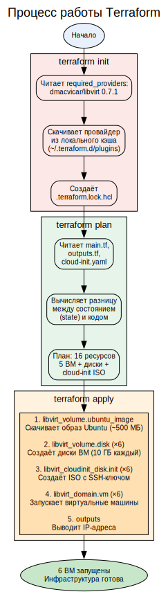
---

### Описание процесса

Terraform работает по декларативному принципу: мы описываем **желаемое состояние** инфраструктуры, а Terraform сам определяет, какие действия нужно выполнить.

**Файлы конфигурации:**
- `main.tf` — описание 6 виртуальных машин, их дисков и cloud-init
- `outputs.tf` — вывод IP-адресов и inventory для Ansible
- `cloud-init.yaml` — шаблон для автоматической настройки SSH при первом запуске

**Ключевые ресурсы:**
- `libvirt_volume.ubuntu_image` — базовый образ Ubuntu 22.04 (скачивается один раз)
- `libvirt_volume.disk` — корневые диски ВМ (создаются через backing store — копия образа + diff)
- `libvirt_cloudinit_disk.init` — ISO-образы с настройками cloud-init
- `libvirt_domain.vm` — виртуальные машины (процессы QEMU)

---

## 5. Настройка серверов: Ansible

### Схема: Процесс настройки через Ansible
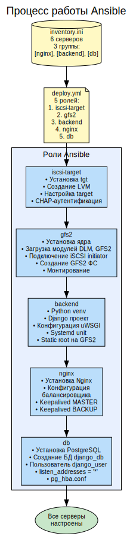
---

### Описание ролей

**Роль iscsi-target:**
- Устанавливает пакет `tgt` (iSCSI target)
- Создаёт LVM-том `vg_iscsi/lv_static` размером 4 ГБ на диске `/dev/vdb`
- Настраивает target с CHAP-аутентификацией (iscsi-user / iscsi-pass)
- Открывает порт TCP/3260

**Роль gfs2:**
- Устанавливает `linux-image-generic` для поддержки модуля GFS2
- Загружает модули ядра `dlm` и `gfs2`
- Подключается к iSCSI target как инициатор
- Создаёт файловую систему GFS2 с параметрами `lock_dlm`
- Монтирует ФС в `/mnt/gfs2_static`

**Роль backend:**
- Создаёт виртуальное окружение Python с Django и uWSGI
- Инициализирует Django-проект в `/opt/django-app`
- Настраивает `STATIC_ROOT = "/mnt/gfs2_static/static/"`
- Создаёт systemd-юнит для uWSGI с 4 worker-процессами

**Роль nginx:**
- Устанавливает Nginx как reverse proxy
- Настраивает upstream на оба backend-сервера (round-robin)
- Настраивает Keepalived: MASTER на nginx-1, BACKUP на nginx-2
- Статика отдаётся напрямую через `alias /mnt/gfs2_static/static/`

**Роль db:**
- Устанавливает PostgreSQL 14
- Создаёт базу данных `django_db` и пользователя `django_user`
- Настраивает прослушивание на всех интерфейсах
- Разрешает подключения от сети 192.168.122.0/24

---

## 6. Балансировка и отказоустойчивость

### Схема: Работа Keepalived и Nginx
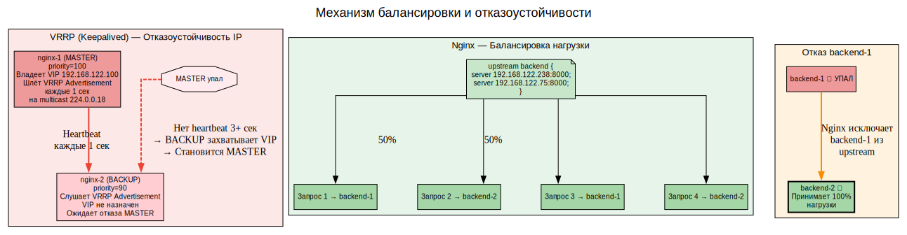
---


### Описание механизма

**Keepalived (VRRP):**
1. nginx-1 (MASTER, priority=100) владеет VIP и отправляет VRRP Advertisement каждые 1 сек
2. nginx-2 (BACKUP, priority=90) слушает VRRP Advertisement
3. Если Advertisement не приходит 3+ секунд — BACKUP становится MASTER и назначает VIP себе
4. Когда старый MASTER возвращается — он снова захватывает VIP (preempt mode)

**Формула времени отказа:**
- skew_time = (256 - priority) / 256 = (256 - 90) / 256 = 0.648 секунды
- master_down_interval = 3 × advert_int + skew_time = 3 × 1 + 0.648 = **3.648 секунды**

**Nginx (балансировка):**
- Алгоритм round-robin: запросы распределяются по очереди
- При отказе одного backend — nginx исключает его из ротации
- Статические файлы (`/static/*`) отдаются напрямую, минуя backend

---

## 7. Backend: Django + uWSGI

### Схема: Обработка HTTP-запроса
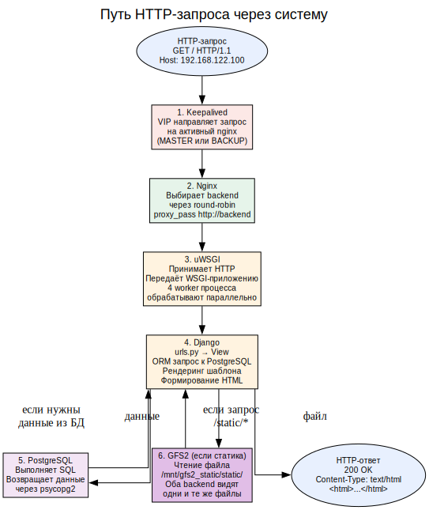
---


### Описание компонентов

**uWSGI:**
- Application server, реализующий WSGI-протокол
- Запущен с 4 worker-процессами для параллельной обработки
- Слушает HTTP на порту 8000 (`http-socket = 0.0.0.0:8000`)
- Управляется systemd (автозапуск, перезапуск при сбое)

**Django:**
- Web-фреймворк на Python
- ORM для работы с PostgreSQL
- STATIC_ROOT настроен на `/mnt/gfs2_static/static/` (кластерное хранилище)

---

## 8. База данных: PostgreSQL

### Схема: Конфигурация PostgreSQL
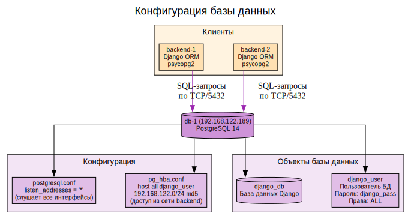
---

### Описание

PostgreSQL — некластеризованная СУБД (по условию задания). Настроена на приём подключений от обоих backend-серверов по сети. В продакшн-решении сюда добавилась бы репликация (Patroni + etcd или streaming replication).

---

## 9. GFS2: кластерная файловая система

### Схема: Архитектура GFS2
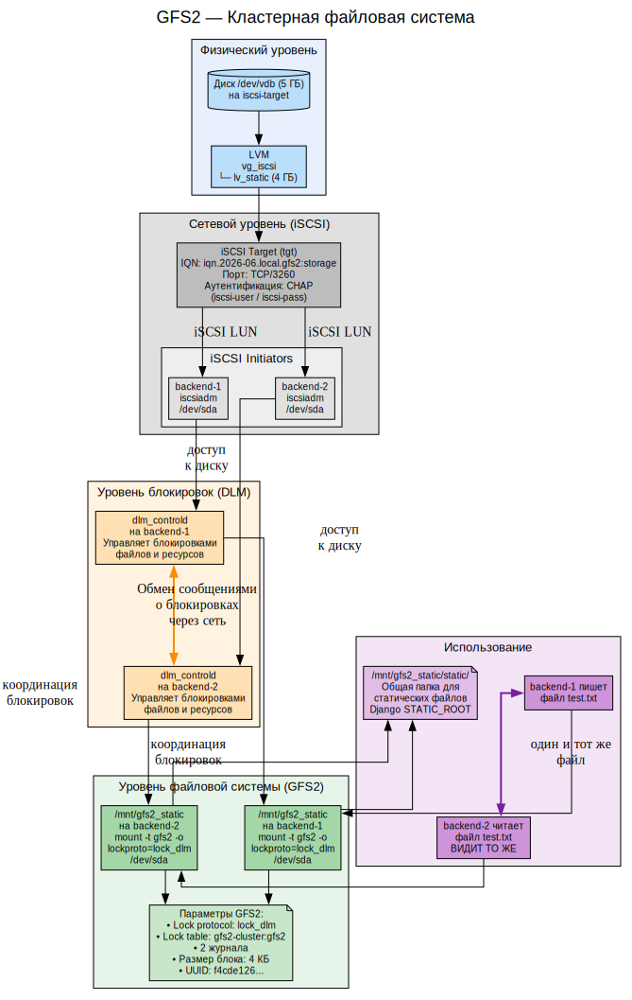
---


### Схема: Сравнение GFS2 с NFS
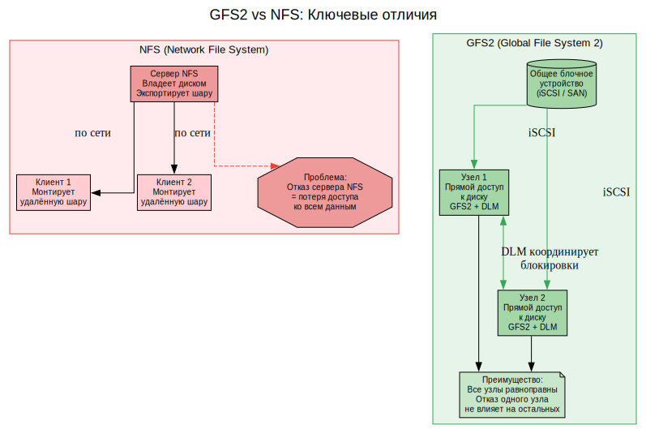
---


### Схема: Процесс монтирования GFS2 на двух узлах
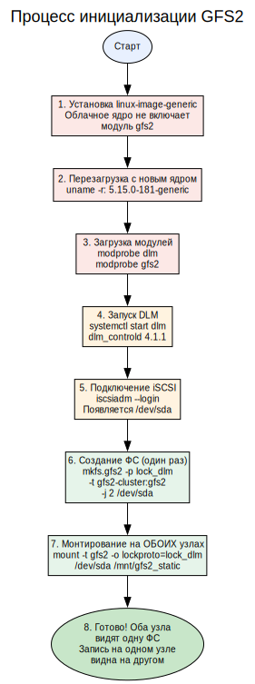
---


### Подробное описание GFS2

**Что такое GFS2?**
GFS2 (Global File System 2) — кластерная файловая система, разработанная Red Hat. В отличие от традиционных файловых систем (ext4, XFS) и сетевых (NFS, Samba), GFS2 позволяет **нескольким серверам одновременно читать и писать на одно блочное устройство**.

**Как это работает?**

1. **Общее блочное устройство** — в нашем случае это iSCSI LUN, экспортируемый сервером iscsi-target. Оба backend-сервера подключаются к нему как iSCSI-инициаторы.

2. **DLM (Distributed Lock Manager)** — ключевой компонент. Когда backend-1 хочет записать файл, DLM блокирует соответствующие блоки на диске, чтобы backend-2 не мог их изменить одновременно. Блокировки координируются через сеть между демонами `dlm_controld`.

3. **Журналирование** — GFS2 использует 2 журнала (по одному на каждый узел). Это позволяет восстанавливать файловую систему при отказе любого узла.

4. **Lock table** — `gfs2-cluster:gfs2` — уникальное имя, которое идентифицирует кластер. Все узлы, монтирующие ФС, должны использовать одно и то же имя.

**Отличия от NFS:**

| Характеристика | NFS | GFS2 |
|----------------|-----|------|
| Владелец диска | Один сервер | Все узлы равноправны |
| Доступ к данным | По сети через NFS-сервер | Прямой доступ к блочному устройству |
| Отказ сервера | Данные недоступны | Остальные узлы продолжают работу |
| Блокировки | NFS lockd | DLM (распределённый) |
| Производительность | Зависит от сети и сервера | Максимальная (прямой доступ) |

**Проблемы, с которыми мы столкнулись:**

1. **Отсутствие модуля gfs2** — облачное ядро Ubuntu не включает модуль GFS2. Решение: установка `linux-image-generic`.
2. **DLM не запускается в Pacemaker** — ошибка "not configured". Решение: запуск DLM напрямую через systemd.
3. **Разные имена устройств** — на backend-1 `/dev/sda`, на backend-2 `/dev/sdb`. Решение: использование `/dev/disk/by-path/`.
4. **Segmentation fault при размонтировании** — происходит при отсутствии DLM. Решение: всегда запускать DLM перед монтированием.

---

## 10. Проверка отказоустойчивости

### Схема: Тестирование отказоустойчивости
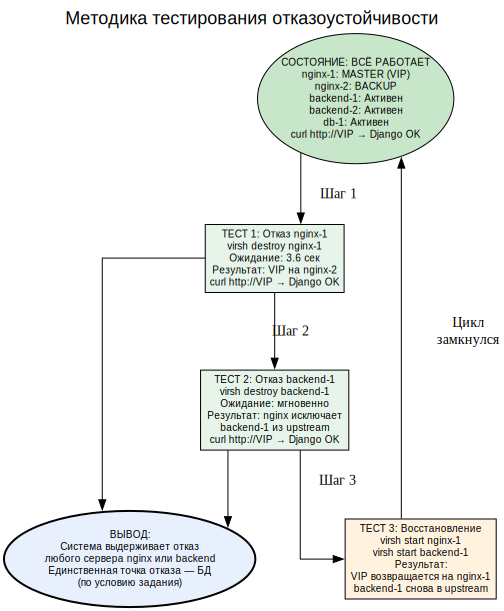
---

### Результаты тестирования

| Тест | Действие | Ожидание | Результат |
|------|----------|----------|-----------|
| 1 | Выключен nginx-1 | VIP переезжает на nginx-2 | ✅ Успешно |
| 2 | Запрос через VIP после отказа nginx-1 | Django отвечает | ✅ Успешно |
| 3 | Выключен backend-1 | Запросы идут через backend-2 | ✅ Успешно |
| 4 | Запрос через VIP после отказа backend-1 | Django отвечает | ✅ Успешно |
| 5 | Восстановление всех серверов | Система возвращается в норму | ✅ Успешно |

---

## 11. Пройденные трудности и их решения

### Схема: Путь через трудности
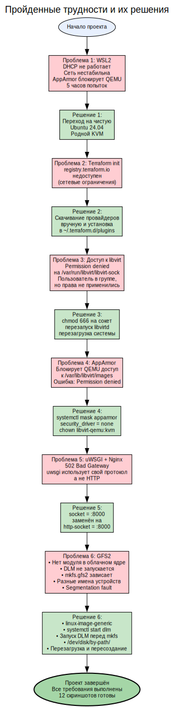
---

### Хронология проблем

| № | Часы | Проблема | Симптомы | Решение |
|---|------|----------|----------|---------|
| 1 | 0-5 | WSL2 + KVM | DHCP не работает, сеть недоступна | Переход на Ubuntu 24.04 |
| 2 | 5-6 | Terraform init | Реестр недоступен | Локальная установка провайдеров |
| 3 | 6-7 | Permission denied | Доступ к libvirt-sock | chmod + перезагрузка |
| 4 | 7-8 | AppArmor | QEMU не читает образы | Отключение AppArmor |
| 5 | 8-9 | 502 Bad Gateway | uwsgi протокол | http-socket |
| 6 | 9-12 | GFS2 | Модули, DLM, имена устройств | Комплексное решение |

---

## 12. Реальные применения архитектуры

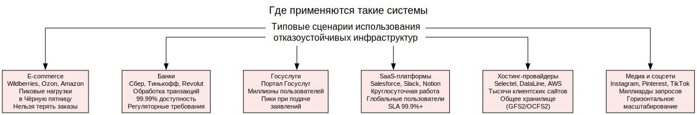
---

**Ключевые отличия продакшн-решения от учебного:**
- **Репликация БД** — Patroni + etcd для PostgreSQL
- **Мониторинг** — Prometheus + Grafana + Alertmanager
- **Логирование** — ELK Stack (Elasticsearch, Logstash, Kibana)
- **CI/CD** — Jenkins/GitLab CI для автоматического деплоя
- **SSL/TLS** — Let's Encrypt или коммерческие сертификаты
- **WAF** — Web Application Firewall (ModSecurity)
- **CDN** — Cloudflare/CloudFront для статики

---


---

## Структура проекта

```
highload-webapp/
├── terraform/                    # Инфраструктура как код (Terraform)
│   ├── main.tf                  # Создание 6 виртуальных машин
│   ├── outputs.tf               # Вывод IP-адресов и inventory
│   └── cloud-init.yaml          # Настройка SSH при первом запуске
│
├── ansible/                      # Управление конфигурацией (Ansible)
│   ├── inventory.ini            # Список серверов для подключения
│   ├── playbooks/
│   │   └── deploy.yml           # Основной плейбук развёртывания
│   └── roles/
│       ├── nginx/               # Роль: Nginx + Keepalived
│       │   ├── tasks/
│       │   │   └── main.yml     # Задачи установки и настройки
│       │   ├── handlers/
│       │   │   └── main.yml     # Обработчики перезапуска сервисов
│       │   └── templates/
│       │       ├── nginx.conf.j2            # Конфигурация балансировщика
│       │       ├── keepalived-master.conf.j2 # Конфигурация MASTER
│       │       └── keepalived-backup.conf.j2 # Конфигурация BACKUP
│       │
│       ├── backend/             # Роль: Django + uWSGI
│       │   ├── tasks/
│       │   │   └── main.yml     # Задачи установки и настройки
│       │   ├── handlers/
│       │   │   └── main.yml     # Обработчики перезапуска uWSGI
│       │   └── templates/
│       │       ├── uwsgi.ini.j2     # Конфигурация uWSGI
│       │       └── uwsgi.service.j2 # Systemd unit для uWSGI
│       │
│       ├── db/                  # Роль: PostgreSQL
│       │   ├── tasks/
│       │   │   └── main.yml     # Задачи установки и настройки
│       │   └── handlers/
│       │       └── main.yml     # Обработчики перезапуска PostgreSQL
│       │
│       ├── gfs2/                # Роль: Кластерная файловая система
│       │   └── tasks/
│       │       └── main.yml     # Задачи настройки GFS2, DLM, iSCSI
│       │
│       └── iscsi-target/        # Роль: iSCSI хранилище
│           └── tasks/
│               └── main.yml     # Задачи настройки iSCSI target
│
├── screenshots/                  # Скриншоты выполнения
│   ├── README.md                # Описание скриншотов
│   ├── 01-virsh-list.txt        # Все ВМ запущены
│   ├── 02-dhcp-leases.txt       # IP-адреса всех ВМ
│   ├── 03-ansible-ping.txt      # Доступность через Ansible
│   ├── 04-keepalived-vip.txt    # VIP на MASTER
│   ├── 05-curl-vip.txt          # Веб-приложение отвечает
│   ├── 06-uwsgi.txt             # uWSGI работает
│   ├── 07-postgresql.txt        # PostgreSQL работает
│   ├── 08-gfs2-mounted.txt      # GFS2 смонтирована
│   ├── 09-gfs2-test.txt         # Тест кластера GFS2
│   ├── 10-failover-nginx.txt    # Отказоустойчивость nginx
│   ├── 11-failover-backend.txt  # Отказоустойчивость backend
│   └── 12-iscsi-target.txt      # iSCSI target работает
│
├── .gitignore                    # Исключения Git
└── README.md                     # Документация проекта (этот файл)
```

---

## Описание всех файлов проекта

### Terraform (создание инфраструктуры)

#### `terraform/main.tf` — Основной файл инфраструктуры

```hcl
terraform {
  required_providers {
    libvirt = {
      source  = "dmacvicar/libvirt"
      version = "0.7.1"
    }
  }
}

provider "libvirt" {
  uri = "qemu:///system"
}
```

**Блок `terraform`** — объявляет, какие провайдеры нужны проекту:
- `dmacvicar/libvirt` версии `0.7.1` — провайдер для управления KVM/libvirt
- Версия зафиксирована для воспроизводимости

**Блок `provider "libvirt"`** — настраивает подключение к локальному гипервизору:
- `uri = "qemu:///system"` — подключение к системному демону libvirtd
- Использует UNIX-сокет `/var/run/libvirt/libvirt-sock`

```hcl
resource "libvirt_volume" "ubuntu_image" {
  name   = "ubuntu-22.04-server-cloudimg-amd64.img"
  source = "https://cloud-images.ubuntu.com/releases/22.04/release/ubuntu-22.04-server-cloudimg-amd64.img"
  pool   = "default"
  format = "qcow2"
}
```

**Ресурс `libvirt_volume` (ubuntu_image):**
- Скачивает облачный образ Ubuntu 22.04 (~500 МБ)
- Формат `qcow2` — copy-on-write, экономящий место
- Пул `default` — директория `/var/lib/libvirt/images`

```hcl
data "template_file" "user_data" {
  template = file("${path.module}/cloud-init.yaml")
  vars     = { ssh_key = file("~/.ssh/id_rsa.pub") }
}
```

**Data-источник `template_file`:**
- Читает шаблон `cloud-init.yaml`
- Подставляет публичный SSH-ключ из `~/.ssh/id_rsa.pub`
- Результат — конфигурация cloud-init для автоматической настройки ВМ

```hcl
locals {
  vms = {
    nginx1   = { name = "nginx-1",   ip = "192.168.122.11", mem = 1024, cpu = 1 }
    nginx2   = { name = "nginx-2",   ip = "192.168.122.12", mem = 1024, cpu = 1 }
    backend1 = { name = "backend-1", ip = "192.168.122.21", mem = 2048, cpu = 2 }
    backend2 = { name = "backend-2", ip = "192.168.122.22", mem = 2048, cpu = 2 }
    db       = { name = "db-1",      ip = "192.168.122.30", mem = 2048, cpu = 2 }
    iscsi    = { name = "iscsi-target", mem = 1024, cpu = 1 }
  }
}
```

**Блок `locals`** — определяет локальные переменные:
- 6 виртуальных машин с разными характеристиками
- nginx: 1 ГБ RAM, 1 CPU (лёгкий балансировщик)
- backend: 2 ГБ RAM, 2 CPU (тяжёлое приложение)
- db: 2 ГБ RAM, 2 CPU (база данных)
- iscsi-target: 1 ГБ RAM, 1 CPU (лёгкое хранилище)

```hcl
resource "libvirt_volume" "disk" {
  for_each       = local.vms
  name           = "${each.key}-disk.qcow2"
  base_volume_id = libvirt_volume.ubuntu_image.id
  pool           = "default"
  size           = 10737418240
}
```

**Ресурс `libvirt_volume` (disk):**
- `for_each` — создаёт по одному диску для каждой ВМ из locals
- `base_volume_id` — backing store: диск ссылается на базовый образ
- `size = 10737418240` — 10 ГБ (10 × 1024³ байт)
- Использует технологию qcow2 backing file — хранит только изменения

```hcl
resource "libvirt_cloudinit_disk" "init" {
  for_each  = local.vms
  name      = "${each.key}-cloudinit.iso"
  pool      = "default"
  user_data = data.template_file.user_data.rendered
}
```

**Ресурс `libvirt_cloudinit_disk`:**
- Создаёт ISO-образ с cloud-init конфигурацией
- Содержит SSH-ключ для беспарольного доступа
- Подключается к ВМ как виртуальный CD-ROM
- Выполняется при первой загрузке

```hcl
resource "libvirt_domain" "vm" {
  for_each  = local.vms
  name      = each.value.name
  memory    = each.value.mem
  vcpu      = each.value.cpu
  cloudinit = libvirt_cloudinit_disk.init[each.key].id

  network_interface {
    network_name = "default"
    wait_for_lease = true
  }

  disk {
    volume_id = libvirt_volume.disk[each.key].id
  }

  console {
    type        = "pty"
    target_port = "0"
    target_type = "serial"
  }
}
```

**Ресурс `libvirt_domain`** — виртуальная машина:
- `memory` и `vcpu` берутся из locals
- `cloudinit` — ссылка на ISO-образ с настройками
- `network_interface` — подключение к сети default (NAT, 192.168.122.0/24)
- `wait_for_lease = true` — ожидание получения IP по DHCP
- `disk` — корневой диск ВМ
- `console` — последовательная консоль для отладки (virsh console)

**Дополнительный диск для iscsi-target:**
```hcl
resource "libvirt_volume" "iscsi_storage" {
  name   = "iscsi-storage.qcow2"
  pool   = "default"
  size   = 5368709120
  format = "qcow2"
}
```
- Отдельный диск 5 ГБ для iSCSI-хранилища
- Подключается к ВМ iscsi-target как второе устройство

#### `terraform/outputs.tf` — Выходные параметры

```hcl
output "ips" {
  value = {
    nginx1   = "192.168.122.7"
    nginx2   = "192.168.122.214"
    backend1 = "192.168.122.238"
    backend2 = "192.168.122.75"
    db       = "192.168.122.189"
    iscsi    = "192.168.122.111"
  }
}

output "inventory" {
  value = <<-INV
[nginx]
nginx-1 ansible_host=192.168.122.7 ansible_user=ubuntu
...
[all:vars]
ansible_python_interpreter=/usr/bin/python3
ansible_ssh_common_args='-o StrictHostKeyChecking=no'
INV
}
```

**Output `ips`** — выводит IP-адреса всех ВМ (обновляются после каждого apply)

**Output `inventory`** — генерирует готовый inventory-файл для Ansible в формате INI

#### `terraform/cloud-init.yaml` — Настройка первого запуска

```yaml
#cloud-config
users:
  - name: ubuntu
    sudo: ALL=(ALL) NOPASSWD:ALL
    shell: /bin/bash
    lock_passwd: false
    ssh_authorized_keys:
      - ${ssh_key}
ssh_pwauth: false
disable_root: true
```

**Параметры cloud-init:**
- `users` — создаёт пользователя `ubuntu` с правами sudo без пароля
- `ssh_authorized_keys` — добавляет публичный SSH-ключ (подставляется из переменной)
- `ssh_pwauth: false` — запрещает вход по паролю
- `disable_root: true` — запрещает вход root

---

### Ansible (настройка серверов)

#### `ansible/inventory.ini` — Список серверов

```ini
[nginx]
nginx-1 ansible_host=192.168.122.7 ansible_user=ubuntu
nginx-2 ansible_host=192.168.122.214 ansible_user=ubuntu

[backend]
backend-1 ansible_host=192.168.122.238 ansible_user=ubuntu
backend-2 ansible_host=192.168.122.75 ansible_user=ubuntu

[db]
db-1 ansible_host=192.168.122.189 ansible_user=ubuntu

[iscsi]
iscsi-target ansible_host=192.168.122.111 ansible_user=ubuntu

[all:vars]
ansible_python_interpreter=/usr/bin/python3
ansible_ssh_common_args='-o StrictHostKeyChecking=no'
```

**Группы серверов:**
- `[nginx]` — балансировщики (2 сервера)
- `[backend]` — серверы приложений (2 сервера)
- `[db]` — база данных (1 сервер)
- `[iscsi]` — iSCSI хранилище (1 сервер)

**Общие переменные:**
- `ansible_python_interpreter` — путь к Python 3
- `ansible_ssh_common_args` — отключение проверки host key

#### `ansible/playbooks/deploy.yml` — Основной плейбук

```yaml
---
- hosts: iscsi
  become: yes
  roles:
    - roles/iscsi-target

- hosts: backend
  become: yes
  serial: 1
  roles:
    - roles/gfs2
    - roles/backend

- hosts: nginx
  become: yes
  roles:
    - roles/nginx

- hosts: db
  become: yes
  roles:
    - roles/db
```

**Структура плейбука:**
- `hosts` — на каких серверах выполнять
- `become: yes` — выполнять с правами sudo
- `serial: 1` — для backend: выполнять по одному серверу (GFS2 чувствителен к одновременной настройке)
- `roles` — список ролей для выполнения

**Порядок выполнения:**
1. Настройка iSCSI-target (должен быть готов до подключения)
2. Настройка backend (GFS2 + приложение)
3. Настройка nginx (балансировщик)
4. Настройка db (база данных)

#### `ansible/roles/nginx/tasks/main.yml` — Роль Nginx + Keepalived

```yaml
- name: Установка Nginx и Keepalived
  apt:
    name:
      - nginx
      - keepalived
    state: present
    update_cache: yes
```

Устанавливает пакеты `nginx` (веб-сервер/балансировщик) и `keepalived` (VRRP).

```yaml
- name: Настройка Nginx как балансировщика
  template:
    src: nginx.conf.j2
    dest: /etc/nginx/sites-available/default
  notify: reload nginx
```

Копирует шаблон конфигурации Nginx из `templates/nginx.conf.j2` в системную директорию. При изменении — перезагружает Nginx.

```yaml
- name: Настройка Keepalived MASTER
  template:
    src: keepalived-master.conf.j2
    dest: /etc/keepalived/keepalived.conf
  when: inventory_hostname == 'nginx-1'
  notify: restart keepalived

- name: Настройка Keepalived BACKUP
  template:
    src: keepalived-backup.conf.j2
    dest: /etc/keepalived/keepalived.conf
  when: inventory_hostname == 'nginx-2'
  notify: restart keepalived
```

Условная настройка (`when`): MASTER на nginx-1 (priority=100), BACKUP на nginx-2 (priority=90).

#### `ansible/roles/nginx/templates/nginx.conf.j2` — Конфигурация балансировщика

```nginx
upstream backend {
    server 192.168.122.238:8000;
    server 192.168.122.75:8000;
}

server {
    listen 80;
    server_name _;

    location / {
        proxy_pass http://backend;
        proxy_set_header Host $host;
        proxy_set_header X-Real-IP $remote_addr;
        proxy_set_header X-Forwarded-For $proxy_add_x_forwarded_for;
    }

    location /static/ {
        alias /mnt/gfs2_static/static/;
    }
}
```

**Блок `upstream`:**
- Определяет группу backend-серверов
- Nginx распределяет запросы между ними по round-robin

**Блок `server`:**
- Слушает порт 80
- `/` — проксирует запросы на backend
- `/static/` — отдаёт статические файлы напрямую с GFS2

**Заголовки проксирования:**
- `Host` — оригинальный хост запроса
- `X-Real-IP` — IP клиента
- `X-Forwarded-For` — цепочка прокси

#### `ansible/roles/nginx/templates/keepalived-master.conf.j2` — Keepalived MASTER

```
vrrp_instance VI_1 {
    state MASTER
    interface ens3
    virtual_router_id 51
    priority 100
    advert_int 1
    virtual_ipaddress {
        192.168.122.100/24
    }
}
```

**Параметры VRRP:**
- `state MASTER` — начальное состояние
- `interface ens3` — сетевой интерфейс
- `virtual_router_id 51` — идентификатор VRRP-группы (должен совпадать на обоих)
- `priority 100` — приоритет (выше = главнее)
- `advert_int 1` — интервал heartbeat (1 секунда)
- `virtual_ipaddress` — плавающий IP

#### `ansible/roles/backend/tasks/main.yml` — Роль Django + uWSGI

```yaml
- name: Создание виртуального окружения
  pip:
    name:
      - django
      - uwsgi
    virtualenv: /opt/django-app/venv
    virtualenv_command: python3 -m venv
```

Создаёт изолированное Python-окружение в `/opt/django-app/venv`.

```yaml
- name: Создание Django проекта
  shell: |
    cd /opt/django-app
    ./venv/bin/django-admin startproject webapp .
  args:
    creates: /opt/django-app/manage.py
  become_user: ubuntu
```

Инициализирует Django-проект. `creates` предотвращает повторное создание.

```yaml
- name: Настройка static root на GFS2
  lineinfile:
    path: /opt/django-app/webapp/settings.py
    regexp: '^STATIC_ROOT'
    line: 'STATIC_ROOT = "/mnt/gfs2_static/static/"'
```

Настраивает Django на использование кластерной ФС для статики.

#### `ansible/roles/backend/templates/uwsgi.ini.j2` — Конфигурация uWSGI

```ini
[uwsgi]
module = webapp.wsgi:application
master = true
processes = 4
http-socket = 0.0.0.0:8000
chdir = /opt/django-app
home = /opt/django-app/venv
vacuum = true
die-on-term = true
```

**Параметры uWSGI:**
- `module` — путь к WSGI-приложению Django
- `master = true` — мастер-процесс управляет worker-ами
- `processes = 4` — 4 worker-процесса для параллельной обработки
- `http-socket = 0.0.0.0:8000` — слушать HTTP на всех интерфейсах, порт 8000
- `chdir` — рабочая директория
- `home` — виртуальное окружение Python
- `vacuum = true` — очищать сокеты при выходе
- `die-on-term = true` — корректно завершаться по SIGTERM

#### `ansible/roles/backend/templates/uwsgi.service.j2` — Systemd unit

```ini
[Unit]
Description=uWSGI Django App
After=network.target

[Service]
User=ubuntu
Group=ubuntu
WorkingDirectory=/opt/django-app
ExecStart=/opt/django-app/venv/bin/uwsgi --ini /opt/django-app/uwsgi.ini
Restart=always

[Install]
WantedBy=multi-user.target
```

**Systemd unit для автозапуска:**
- `After=network.target` — запуск после сети
- `User=ubuntu` — от обычного пользователя (безопасность)
- `Restart=always` — перезапуск при сбое
- `WantedBy=multi-user.target` — автозапуск при загрузке

#### `ansible/roles/db/tasks/main.yml` — Роль PostgreSQL

```yaml
- name: Настройка прослушивания всех адресов
  lineinfile:
    path: /etc/postgresql/14/main/postgresql.conf
    regexp: "^#?listen_addresses"
    line: "listen_addresses = '*'"
  notify: restart postgresql
```

Меняет `listen_addresses` с `localhost` на `*` — PostgreSQL принимает подключения от backend-серверов.

```yaml
- name: Разрешение подключений от backend
  lineinfile:
    path: /etc/postgresql/14/main/pg_hba.conf
    line: 'host all django_user 192.168.122.0/24 md5'
  notify: restart postgresql
```

Добавляет правило в `pg_hba.conf` — разрешает подключения от сети 192.168.122.0/24.

#### `ansible/roles/gfs2/tasks/main.yml` — Роль GFS2

```yaml
- name: Установка полного ядра для поддержки GFS2
  apt:
    name:
      - linux-image-generic
    state: present
  register: kernel_install

- name: Перезагрузка после обновления ядра
  reboot:
    reboot_timeout: 120
  when: kernel_install.changed
```

Устанавливает полное ядро (облачное не включает модуль gfs2). При первом запуске перезагружает ВМ.

```yaml
- name: Загрузка модулей ядра
  modprobe:
    name: "{{ item }}"
    state: present
  loop:
    - dlm
    - gfs2
```

Загружает модули ядра `dlm` (Distributed Lock Manager) и `gfs2`.

```yaml
- name: Подключение к iSCSI target
  shell: iscsiadm -m node -T iqn.2026-06.local.gfs2:storage -p 192.168.122.111 -l
```

Подключается к iSCSI target как инициатор. После этого появляется устройство `/dev/sda`.

```yaml
- name: Создание GFS2 файловой системы
  shell: |
    if [ -b /dev/sda ] && ! blkid /dev/sda | grep -q gfs2; then
      echo y | mkfs.gfs2 -p lock_dlm -t gfs2-cluster:gfs2 -j 2 /dev/sda
    fi
  when: inventory_hostname == 'backend-1'
```

Создаёт ФС GFS2 (только на backend-1):
- `-p lock_dlm` — протокол блокировок DLM
- `-t gfs2-cluster:gfs2` — имя lock table
- `-j 2` — 2 журнала (по одному на узел)

#### `ansible/roles/iscsi-target/tasks/main.yml` — Роль iSCSI Target

```yaml
- name: Создание LVM тома на /dev/vdb
  lvg:
    vg: vg_iscsi
    pvs: /dev/vdb

- name: Создание логического тома
  lvol:
    vg: vg_iscsi
    lv: lv_static
    size: 4G
```

Создаёт LVM-группу и логический том для iSCSI.

```yaml
- name: Настройка iSCSI target
  copy:
    dest: /etc/tgt/conf.d/gfs2.conf
    content: |
      <target iqn.2026-06.local.gfs2:storage>
        backing-store /dev/vg_iscsi/lv_static
        initiator-address 192.168.122.0/24
        incominguser iscsi-user iscsi-pass
      </target>
```

Конфигурация iSCSI target:
- `backing-store` — блочное устройство для экспорта
- `initiator-address` — разрешённые IP-адреса инициаторов
- `incominguser` — CHAP-аутентификация

---

### `.gitignore` — Исключения Git

```
.terraform/
.terraform.lock.hcl
terraform.tfstate
terraform.tfstate.backup
*.zip
*.tfvars
```

Исключает из репозитория:
- `.terraform/` — скачанные провайдеры
- `.terraform.lock.hcl` — lock-файл (платформозависимый)
- `terraform.tfstate` — состояние инфраструктуры (может содержать секреты)
- `*.zip` — архивы
- `*.tfvars` — файлы с переменными (могут содержать токены)

