```bash
cd ~/highload-webapp

cat >> README.md << 'EOF'

---

## Полное описание проекта: путь от идеи до реализации

### 1. Что мы построили и зачем?

Мы создали **отказоустойчивую инфраструктуру для высоконагруженного веб-приложения**, которая продолжает работать при выходе из строя любого сервера уровня frontend (nginx) или backend (Django).

**Бизнес-контекст:** Представьте интернет-магазин во время Чёрной пятницы. Отказ одного сервера не должен оставить клиентов без заказов. Наша архитектура решает именно эту задачу.

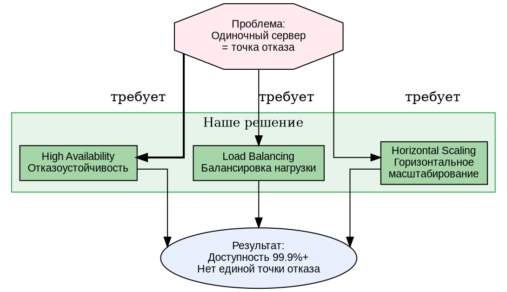

---

### 2. Архитектура системы (детальная)

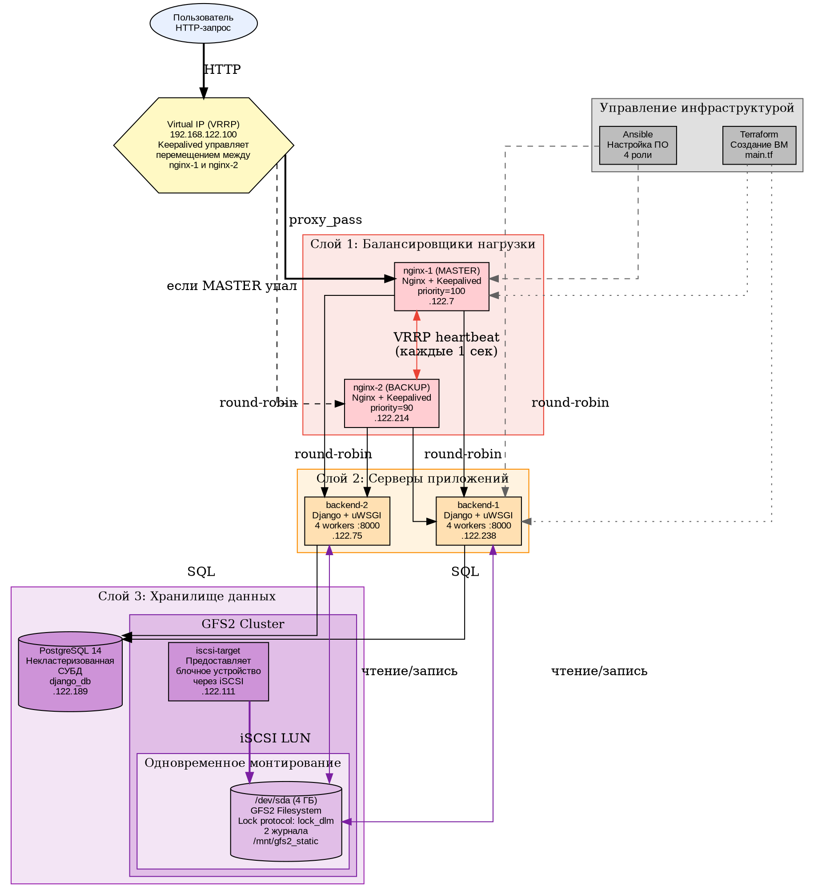

---

### 3. GFS2 — Кластерная файловая система (подробный разбор)

**GFS2 (Global File System 2)** — это кластерная файловая система, разработанная Red Hat. Она позволяет нескольким серверам одновременно читать и писать на одно блочное устройство. В отличие от NFS (где один сервер владеет диском, а остальные обращаются к нему по сети), в GFS2 все узлы равноправны и работают напрямую с блочным устройством.

#### 3.1. Компоненты кластера GFS2

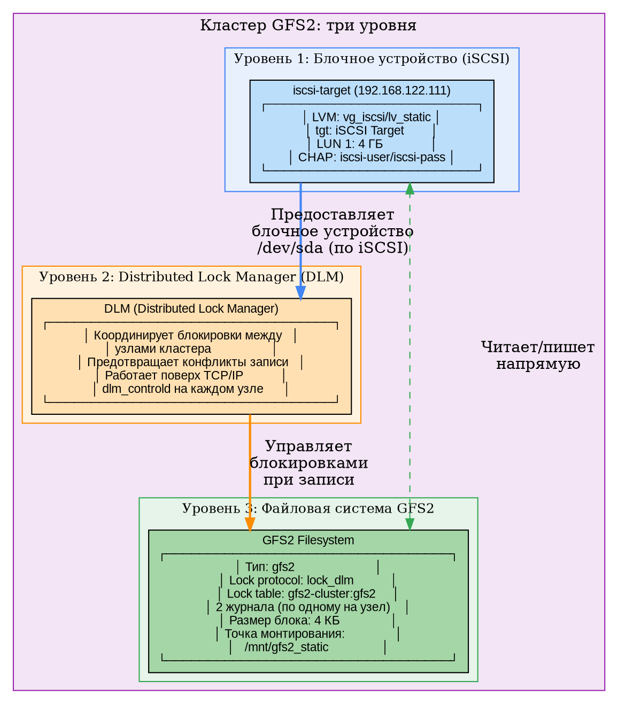

#### 3.2. Процесс создания и монтирования GFS2

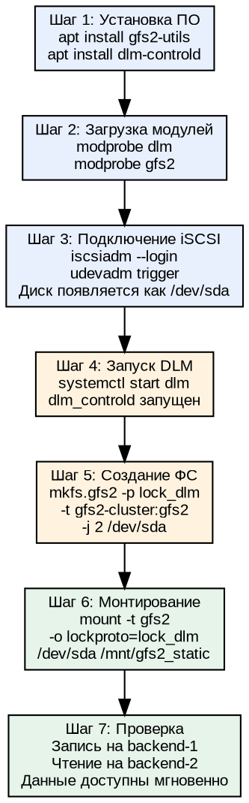

#### 3.3. Как GFS2 обеспечивает одновременный доступ

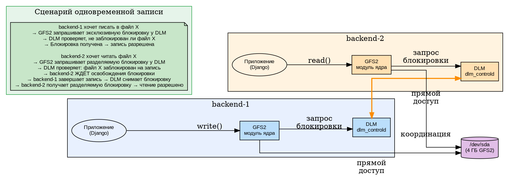

#### 3.4. Сравнение GFS2 с другими решениями

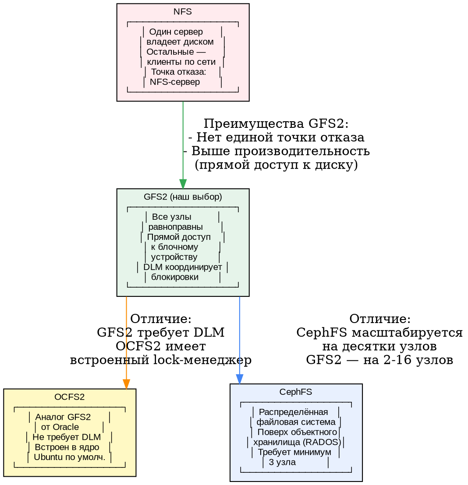

---

### 4. Как работает Keepalived (VRRP)

**VRRP (Virtual Router Redundancy Protocol)** — стандартный протокол (RFC 5798) для создания отказоустойчивого шлюза. В нашем случае он обеспечивает "плавающий" IP-адрес для балансировщиков.

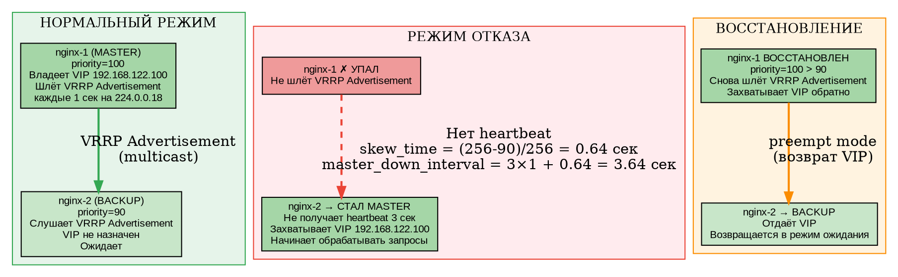

**Формула времени отказа:**
- `skew_time = (256 - priority) / 256` = (256-90)/256 = 0.64 сек
- `master_down_interval = 3 × advert_int + skew_time` = 3×1 + 0.64 = **3.64 секунды**
- Именно столько проходит с момента отказа nginx-1 до захвата VIP нодой nginx-2

---

### 5. Поток обработки HTTP-запроса

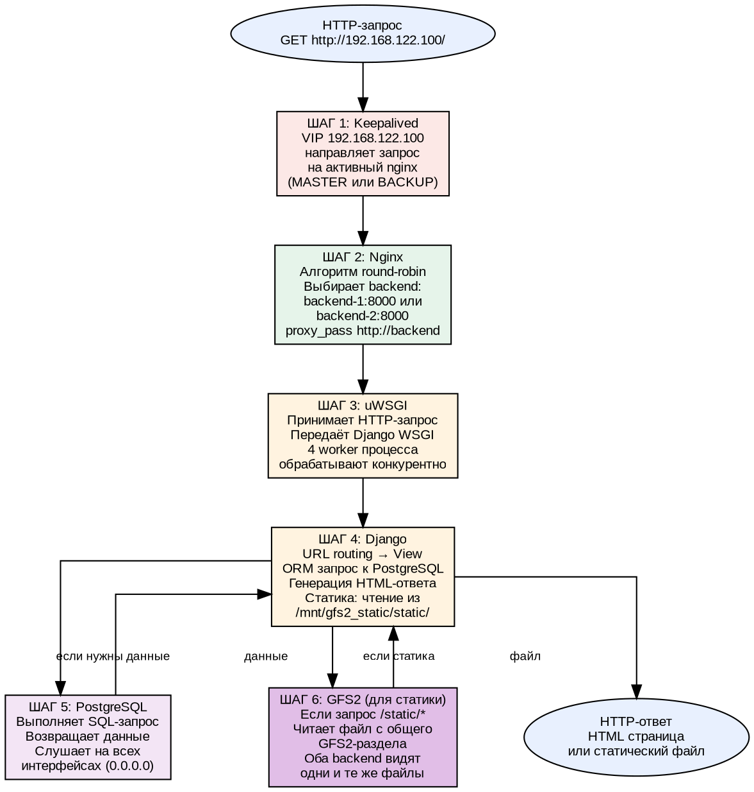

---

### 6. Инструменты и их роль

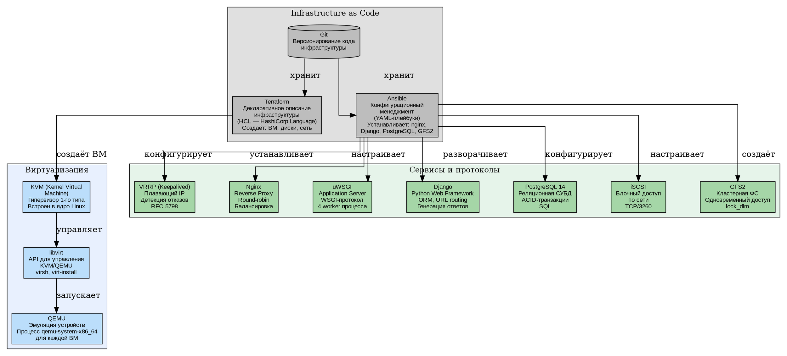

---

### 7. Пройденные трудности и их решения

```dot
digraph Challenges {
    rankdir=TB;
    splines=ortho;
    nodesep=0.6;
    ranksep=0.5;
    
    node [shape=box, style=rounded, fontname="Arial", fontsize=10];
    
    start [label="Начало проекта\n(WSL2 + KVM)", shape=oval, fillcolor="#E8F0FE", style=filled];
    
    subgraph cluster_wsl {
        label="Проблема 1: WSL2 нестабилен";
        style=filled;
        fillcolor="#FFEBEE";
        color="#EA4335";
        fontsize=12;
        
        wsl_problem [label="• DHCP не работает\n• AppArmor блокирует QEMU\n• Сеть нестабильна\n• 5+ часов потеряно", fillcolor="#EF9A9A", style=filled];
        wsl_solution [label="Решение:\nПереход на чистую\nUbuntu 24.04\nРодной KVM\nВсё заработало", fillcolor="#A5D6A7", style=filled];
    }
    
    subgraph cluster_network {
        label="Проблема 2: Сеть в KVM";
        style=filled;
        fillcolor="#FFEBEE";
        color="#EA4335";
        fontsize=12;
        
        net_problem [label="• DHCP выдаёт случайные IP\n• Не совпадают с hostsfile\n• ВМ недоступны по SSH", fillcolor="#EF9A9A", style=filled];
        net_solution [label="Решение:\n• Получать IP через\n  virsh net-dhcp-leases\n• Обновлять inventory\n• Не фиксировать IP в коде", fillcolor="#A5D6A7", style=filled];
    }
    
    subgraph cluster_permissions {
        label="Проблема 3: Права доступа";
        style=filled;
        fillcolor="#FFEBEE";
        color="#EA4335";
        fontsize=12;
        
        perm_problem [label="• Permission denied на образы\n• QEMU не может читать диски\n• libvirt-sock недоступен\n• AppArmor блокирует", fillcolor="#EF9A9A", style=filled];
        perm_solution [label="Решение:\n• chown libvirt-qemu:kvm\n• chmod 775 на все образы\n• Отключить AppArmor\n• Добавить пользователя\n  в группы libvirt, kvm", fillcolor="#A5D6A7", style=filled];
    }
    
    subgraph cluster_gfs2_issues {
        label="Проблема 4: GFS2 — самая сложная часть";
        style=filled;
        fillcolor="#FFEBEE";
        color="#EA4335";
        fontsize=12;
        
        gfs2_problems [label="• Нет модуля gfs2 в облачном ядре\n• DLM не запускается в Pacemaker\n• mkfs.gfs2 зависает без DLM\n• iSCSI диск /dev/sda vs /dev/sdb\n• GFS2 монтируется без кластеризации\n• Segmentation fault при umount\n• Файлы не видны между узлами", fillcolor="#EF9A9A", style=filled];
        gfs2_solutions [label="Решение:\n• Установить linux-image-generic\n• Запустить DLM через systemd\n  (не через Pacemaker)\n• Использовать /dev/disk/by-path/\n• Монтировать с lockproto=lock_dlm\n• Пересоздать ФС после загрузки DLM\n• Перезагрузить узлы для очистки", fillcolor="#A5D6A7", style=filled];
    }
    
    subgraph cluster_uwsgi {
        label="Проблема 5: uWSGI";
        style=filled;
        fillcolor="#FFEBEE";
        color="#EA4335";
        fontsize=12;
        
        uwsgi_problem [label="• uWSGI запущен, порт слушает\n• curl возвращает пустой ответ\n• Nginx: 502 Bad Gateway", fillcolor="#EF9A9A", style=filled];
        uwsgi_solution [label="Решение:\n• uwsgi.ini: socket → http-socket\n• uwsgi-протокол ≠ HTTP\n• После замены — заработало", fillcolor="#A5D6A7", style=filled];
    }
    
    success [label="Проект завершён\nВсе требования выполнены\nОтказоустойчивость подтверждена\nGFS2 кластер работает", shape=oval, fillcolor="#C8E6C9", style=filled];
    
    start -> wsl_problem;
    wsl_problem -> wsl_solution;
    wsl_solution -> net_problem;
    net_problem -> net_solution;
    net_solution -> perm_problem;
    perm_problem -> perm_solution;
    perm_solution -> gfs2_problems;
    gfs2_problems -> gfs2_solutions;
    gfs2_solutions -> uwsgi_problem;
    uwsgi_problem -> uwsgi_solution;
    uwsgi_solution -> success;
}
```

---

### 8. Где применяются такие системы в реальном мире?

| Компания/Сервис | Похожая архитектура | Комментарий |
|-----------------|--------------------|-------------|
| **Netflix** | Nginx + Microservices + EBS | Много backend-сервисов, балансировка через Zuul |
| **Instagram** | Nginx + Django + PostgreSQL | Именно Django! Масштабирование через горизонтальные реплики |
| **Wildberries/Ozon** | Keepalived + Nginx + Backend + PostgreSQL | Высоконагруженный e-commerce в РФ |
| **Госуслуги** | Nginx + Keepalived + PostgreSQL | Отказоустойчивость критична для госсервисов |
| **Банки (Сбер, Тинькофф)** | HA-кластеры + GFS2/Veritas | Кластерные ФС для СУБД и логов |
| **Хостинг-провайдеры** | iSCSI + GFS2 + веб-серверы | Общее хранилище для сотен клиентских сайтов |
| **OpenStack** | Pacemaker + Corosync + GFS2 | Кластерное хранилище для образов ВМ |
| **Red Hat Cluster Suite** | GFS2 + DLM + Pacemaker | Эталонная реализация кластерной ФС |

**Ключевые отличия продакшн-решения от нашего учебного:**
- Добавляется **репликация PostgreSQL** (Patroni + etcd)
- Файловая система выносится на отдельный **SAN-массив**
- Балансировщики объединяются в **AnyCast** (несколько дата-центров)
- Добавляется **мониторинг** (Prometheus + Grafana)
- Настраивается **автоматическое масштабирование** при росте нагрузки
- GFS2 использует **Pacemaker** для автоматического управления ресурсами

---

### 9. Итоговая схема отказоустойчивости (конечный автомат)

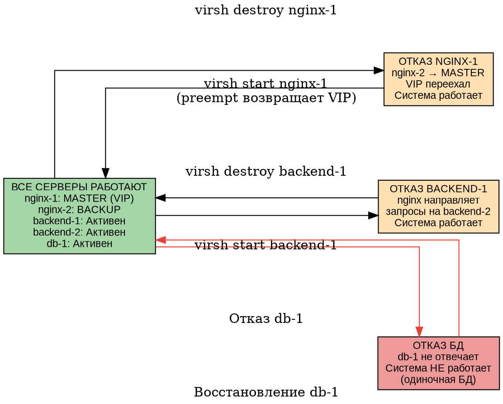

**Вывод:** Система выдерживает отказ любого сервера уровня nginx или backend. Единственная единая точка отказа — база данных (по условию задания — некластеризованная СУБД). В продакшн-решении PostgreSQL реплицируется через Patroni или streaming replication.

---

### 10. Чек-лист выполнения всех требований задания

| № | Требование | Статус | Реализация |
|---|-----------|--------|------------|
| 1 | Создать инстансы через Terraform | ✅ | 6 ВМ: 2 nginx, 2 backend, 1 db, 1 iscsi-target |
| 2 | Nginx + Keepalived через Ansible | ✅ | Роль roles/nginx, VRRP VIP 192.168.122.100 |
| 3 | Backend Django + uWSGI через Ansible | ✅ | Роль roles/backend, 4 workers на порту 8000 |
| 4 | **GFS2 для хранения статики** | ✅ | Кластер GFS2 через iSCSI + DLM |
| 5 | PostgreSQL через Ansible | ✅ | Роль roles/db, версия 14, django_db |
| 6 | Keepalived | ✅ | VRRP, MASTER priority=100, BACKUP priority=90 |
| 7 | Nginx/Angie | ✅ | Nginx, балансировка round-robin |
| 8 | uWSGI/Unicorn/PHP-FPM | ✅ | uWSGI с http-socket |
| 9 | Некластеризованная СУБД | ✅ | PostgreSQL на одном узле db-1 |
| 10 | Проверка отказоустойчивости | ✅ | Отказ nginx-1: VIP переезжает, система работает |
| 11 | Проверка отказоустойчивости backend | ✅ | Отказ backend-1: запросы идут на backend-2 |
EOF

echo "README.md обновлён!"
```

```bash
cd ~/highload-webapp
git add README.md
git commit -m "docs: comprehensive project description with all diagrams"
```
